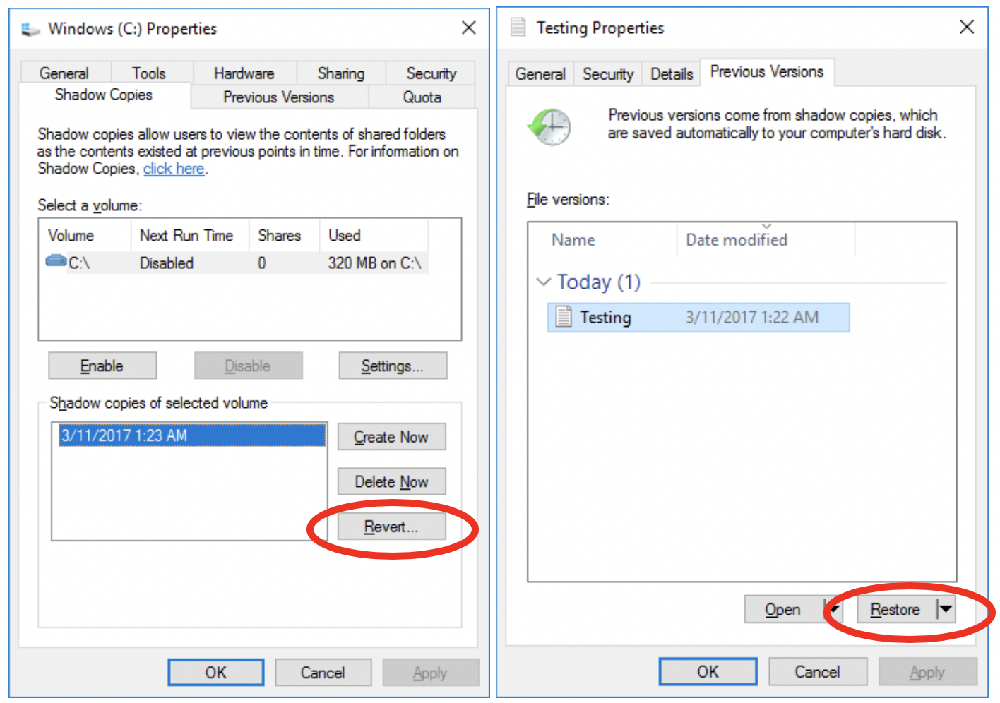
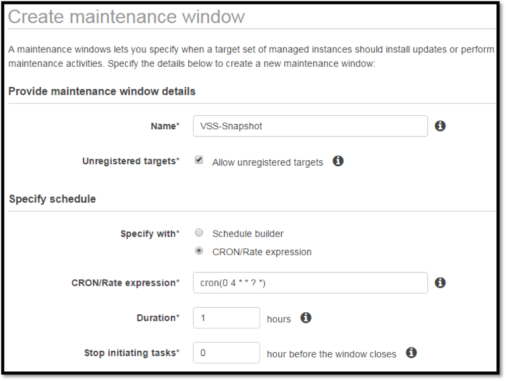

Early in my career, I learned an important lesson: backup is easy, but restore is hard. Too often we take our backup and recovery for granted. We assume that if the backup completed successful, the restore will work when we need it. Anyone who has been through a disaster recovery exercise, whether simulated or real, knows this is seldom the case. 

In this post I discuss creating consistent backups of Windows Servers using the [Volume Shadow Copy Service (VSS)](https://msdn.microsoft.com/en-us/library/windows/desktop/aa384649.aspx) and [Elastic Block Store (EBS)](https://aws.amazon.com/ebs/) snapshots.  I will also use [AWS Systems Manager](https://aws.amazon.com/ec2/) to schedule daily backups of EBS volumes during a defined maintenance window. Feel free to follow along, but be aware that there is a CloudFormation template toward the end that will help you configure the final solution.  

# Background

An Amazon Elastic Block Store (EBS) [Snapshot](http://docs.aws.amazon.com/AWSEC2/latest/UserGuide/EBSSnapshots.html) is a point-in-time copy of EBS Volume saved to [mazon Simple Storage Service (S3)](https://aws.amazon.com/s3/) which provides 99.999999999% durability. EBS Snapshots are a convenient way to back up a volume, but you must be careful to ensure a consistent backup. Most backup applications work at the file level, backing up one file at a time. EBS Snapshots work at the block level, copying blocks with no awareness of how files are stored across those blocks. According to the EBS documentation: 

> You can take a snapshot of an attached volume that is in use. However, snapshots only capture data that has been written to your Amazon EBS volume at the time the snapshot command is issued. This might exclude any data that has been cached by any applications or the operating system. If you can pause any file writes to the volume long enough to take a snapshot, your snapshot should be complete. However, if you can't pause all file writes to the volume, you should unmount the volume from within the instance, issue the snapshot command, and then remount the volume to ensure a consistent and complete snapshot. You can remount and use your volume while the snapshot status is pending. http://docs.aws.amazon.com/AWSEC2/latest/UserGuide/ebs-creating-snapshot.html

It is not always possible to stop your application long enough to take a backup. Microsoft knows this and created a service for Windows called the Volume Shadow Copy Service (VSS). According to Microsoft, VSS “[allows volume backups to be performed while applications on a system continue to write to the volumes.](https://msdn.microsoft.com/en-us/library/aa384649.aspx)” VSS does this in two ways.  First, it creates a read only copy of the volume at a point in time, called a shadow copy. Backup applications can read from this shadow copy without concern for the changes that are occurring on the volume. Second, VSS exposes an API that other applications can use to ensure that they have flushed all their buffers to disk when the shadow copy is created.  Microsoft SQL Server, Active Directory, SharePoint, and many other enterprise applications support this API.

VSS was designed for traditional enterprise backup applications that work at the file level. These applications create a shadow copy and read files from the copy. While EBS snapshots cannot read directly from the shadow copy (snapshots capture the entire volume at the block level) it is still beneficial to create a shadow copy before creating an EBS snapshot. After restoring a snapshot you can simply revert your volume to the prior shadow copy as shown in the figure on the left. *Note that you cannot revert a shadow copy on the boot volume; therefore, you need to mount the volume to another running Windows instance to revert it. In addition, you can restore individual files from the shadow copy as shown in the figure on the right.*

   

# Automating Snapshots with PowerShell

Now that you have an understanding of VSS, you can use it to create a consistent snapshot of Windows Server instances running on EC2. In this section I will create a script to initiate a snapshot of an instance after first creating a shadow copy.  The script must be running on the EC2 instance to create the shadow copy so the instance will need permission to describe its volumes and create snapshots. Therefore, I created an [EC2 Instance Profile](http://docs.aws.amazon.com/IAM/latest/UserGuide/id_roles_use_switch-role-ec2_instance-profiles.html) with the following access policy and associated it with my test instance. *Note: this policy allows one instance to describe and create a snapshot of every instance in your account. You may choose to use [resource-level permissions](http://docs.aws.amazon.com/AWSEC2/latest/UserGuide/ec2-supported-iam-actions-resources.html) to narrow the scope.*


{
    "Version": "2012-10-17",
    "Statement": 
    {
        "Effect": "Allow",
        "Action": ["ec2:CreateSnapshot","ec2:DescribeInstances"],
        "Resource": "*"
    }
}


The script below uses the [metadata API](http://docs.aws.amazon.com/AWSEC2/latest/UserGuide/ec2-instance-metadata.html) and the [AWS Tools for Windows PowerShell](https://aws.amazon.com/powershell/) to find all the EBS volumes attached to an EC2 instance and create a snapshot of each. 


#Use the Meta-data API to learn what instance and region this script is running in.
$InstanceId = (Invoke-WebRequest '169.254.169.254/latest/meta-data/instance-id' -UseBasicParsing).Content
$AZ = (Invoke-WebRequest '169.254.169.254/latest/meta-data/placement/availability-zone' -UseBasicParsing).Content
$Region = $AZ.Substring(0, $AZ.Length -1)

#Find all the volumes attached to this instance and create a Snapshot of each
$Volumes = (Get-EC2Instance -Region $Region -Instance $InstanceId).Instances.BlockDeviceMappings.Ebs.VolumeId
$Volumes | %{New-EC2Snapshot -Region $Region -VolumeId $_ -Description "Created by VSS-Snapshot;}


Of course, before you create the snapshot, you want to create a shadow copy. Windows includes a command line utility called DISKSHADOW.exe. DISKSHADOW.exe takes a series of commands in a text file as arguments. In the script below, I **BEGIN** a new backup and **ADD** all of the volumes that I want to capture to the shadow copy set. My instance has three volumes. Two are mounted as drives (C: and D:). The third is mounted to a folder (C:\Mount01) in the file system.  It is important to create a shadow copy of all the volumes at the same time so the files are consistent across them. 


SET CONTEXT CLIENTACCESSIBLE
BEGIN BACKUP
ADD VOLUME C:\
ADD VOLUME C:\Mount01\
ADD VOLUME D:\
CREATE
EXEC CreateEBSSnapshots.bat %VSS_SHADOW_SET%
DELETE SHADOWS SET %VSS_SHADOW_SET%
END BACKUP
EXIT


Once I have added all the volumes, I can **CREATE** the shadow and **EXECUTE** my backup application. In this case, my backup application is the PowerShell script above. Note that you cannot call PowerShell directly, so I have wrapped my script with a batch file. Finally, I **DELETE** the shadow set. It is important to delete the shadow set because shadow copies take up additional space on the volume and you are limited to 64 shadow copies.  Note that you do not need to wait for the EBS Snapshots to complete before deleting the shadow copy. 

The PowerShell script below brings this all together in one place.  First, it creates a script to back up all the EBS volumes attached to the instance it is running on. Second it generates a custom DISKSHADOW.exe script that adds all the volumes to the shadow copy set. Finally, it initiates the backup process and cleans up after itself. You could run this as a scheduled task on your system, but it would be better to use the new EC2 Systems Manager to schedule it during a defined maintenance window. 


$TempPath = [System.IO.Path]::GetTempPath()

@'
$SetId=$args[0]
#Use the Meta-data API to learn what instance and region this script is running in.
$InstanceId = (Invoke-WebRequest '169.254.169.254/latest/meta-data/instance-id' -UseBasicParsing).Content
$AZ = (Invoke-WebRequest '169.254.169.254/latest/meta-data/placement/availability-zone' -UseBasicParsing).Content
$Region = $AZ.Substring(0, $AZ.Length -1)
#Find all the volumes attached to this instance and create a Snapshot of each
$Volumes = (Get-EC2Instance -Region $Region -Instance $InstanceId).Instances.BlockDeviceMappings.Ebs.VolumeId
$Volumes | %{New-EC2Snapshot -Region $Region -VolumeId $_ -Description "Created by VSS-Snapshot; Instance=$InstanceId; VSSSetId=$SetId"}
'@ | Set-Content (Join-Path $TempPath 'CreateEBSSnapshots.ps1')

"Powershell.exe $(Join-Path $TempPath 'CreateEBSSnapshots.ps1') %1" | Set-Content (Join-Path $TempPath 'CreateEBSSnapshots.bat')

'SET CONTEXT CLIENTACCESSIBLE', 'BEGIN BACKUP' +
(Get-WmiObject Win32_Volume|%{"ADD VOLUME $($_.Name)"}) +
'CREATE', "EXEC $(Join-Path $TempPath 'CreateEBSSnapshots.bat') %VSS_SHADOW_SET%" + 
'DELETE SHADOWS SET %VSS_SHADOW_SET%', 'END BACKUP' + 
'EXIT' | Set-Content (Join-Path $TempPath 'CreateEBSSnapshots.dsh')

DISKSHADOW.EXE /s (Join-Path $TempPath 'CreateEBSSnapshots.dsh')

Remove-Item (Join-Path $TempPath 'CreateEBSSnapshots.dsh')
Remove-Item (Join-Path $TempPath 'CreateEBSSnapshots.ps1')
Remove-Item (Join-Path $TempPath 'CreateEBSSnapshots.bat') 


# Scheduling Snapshots with EC2 Systems Manager

EC2 Systems Manager allows us to run commands on EC2 instances during defined maintenance windows. We can use Systems Manager to create a daily maintenance window for backups and execute our backup script using run command. All without ever logging into the instance.  I have created an AWS CloudFormation template that will help you create a run command document with our PowerShell script and two IAM roles: one to attach to instances you want to backup and one you attach to the maintenance window so it can execute run command.  You can download that template [here](template.json). 

Once the CloudFormation template completes, you are ready to configure our backup. First, you need to assign a role to your instance so it can communicate with Systems Manager and the EC2 API. The CloudFormation template created a role that begins with “VSS-Snapshot-InstanceProfile-” which has the proper permissions. Note that you can now attach a role with an existing instance but you may have to reboot the instance for System Manager to pick up the change. 

Next, we can define our maintenance window. From the EC2 Console, navigate to Maintenance Windows and click the “Create maintenance window” button.  In the example below I have defined a one hour maintenance window that begins at 4AM UTC. *Note that “Allow unregistered targets” let’s you to add individual EC2 instances to the window rather than defining a rule to match them (e.g. All instances tagged with VSS-Snapshot=True). When you are done, click the “Create maintenance window” button at the bottom of the screen.*

 
Now, select the maintenance window you just created from the list and click “Register Tasks” available from the Actions dropdown button. On the Register Tasks screen, find and select the document that begins “VSS-Snapshot-RunCommand-”. In the targets section, select the instances you want to back up.  In the Parameters section, find the role that begins “VSS-Snapshot-TaskRole-”, and set the task to execute on 100 percent concurrently and stop after 10 errors. See my example below. Finally, click “Register Task.”

 
With the Maintenance Window configured, Systems Manager will run the PowerShell script on each instance once a day. The PowerShell script will create a shadow copy set that includes all the Windows volumes on the instance and then initiate a snapshot of each EBS volume. This will greatly improve the reliability of your Windows backups over a simple EBS snapshot. If you need help restoring a volume see the [Amazon EC2 User Guide for Windows Instances](http://docs.aws.amazon.com/AWSEC2/latest/WindowsGuide/ebs-restoring-volume.html). Of course I began this article by saying, “backup is easy, but restore is hard.” Never trust that your backups are reliable, even using VSS. Always test your restore process regularly so you are ready when a disaster strikes.  
