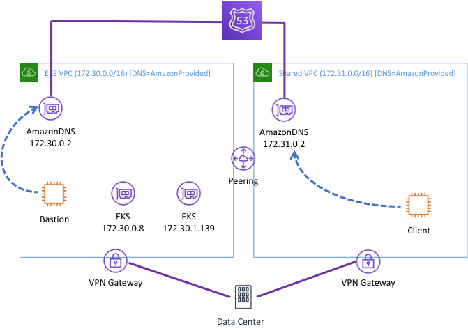
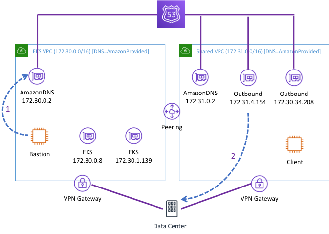
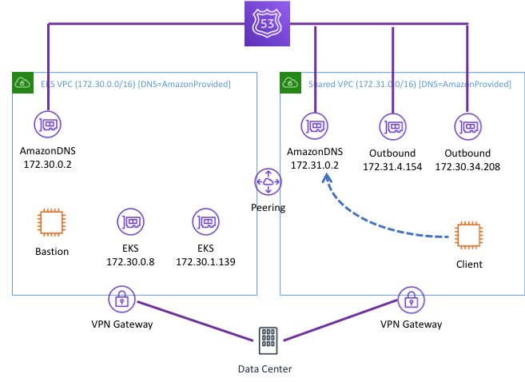
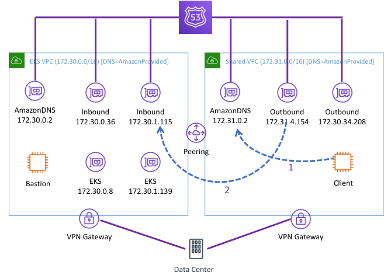

I have been working on a project to deploy Elastic Kubernetes Service (EKS)
at an Academic Medical Center. They want to deploy a private cluster that
does not have internet acess. EKS supports this, but DNS resolution can 
be tricky. There is an 
[AWS blog post](https://aws.amazon.com/blogs/compute/enabling-dns-resolution-for-amazon-eks-cluster-endpoints/)
that explains how do it.

Ultimately, we need an inbound R53 resolver ENI in the EKS VPC. When you 
configure EKS with a private endpoint it configures DNS to only respond 
to requests from within the VPC. The blog post describes this in detail, 
but I found it a little hard to follow. I needed to draw a diagram to 
make sense of it. So here are my notes.

Let’s start with the default configuration assuming you do not make any 
changes to the R53 resolver. This is pictured below. I created these two
VPCs in a single account and added VPN connection to on-prem. Note that 
I am using the Amazon Provided DNS endpoint (aka the Plus 2 endpoint) in 
my DHCP config in all of the scenarios below. In this configuration:
 
1) **Bastion** can resolve the EKS endpoint because it is in the same 
VPC with EKS.

2) **Client** cannot resolve the EKS endpoint because it is making the 
request in the shared services VPC.

3) Neither **Client** nor **Bastion** can resolve on-prem address without 
a forwarder rule and R53 outbound endpoint.

4) Both **Client** and **Bastion** can resolve internet addresses but 
do so through AWS without going back to campus.
 

 
 
Next, I configured an outbound ENI for R53 so I could route requests back 
to campus for on-prem and internet resolution. I created this in the shared 
account. All the VPCs that share these ENIs. There is no need to create more. 
In the picture, I show **Bastion** sending a request to the Amazon Provided 
Endpoint (1). R53 the forwards that request to campus from the outbound 
ENI (2). I did not show a request from **Client** but it would follow the 
same two-step path as the request from **Bastion** but will use the local 
Amazon Provided DNS endpoint.
 
 
 
Now imagine that **Client** needs to resolve the IPs for EKS. Notice that 
the request from **Client** still occurs in another VPC. Remember that EKS 
has configured DNS to only respond to requests in the EKS VPC. The default 
forwarder rule will send this request back to on-prem where it cannot be 
resolved. Therefore, this request does not get a response. We need to 
configure a forwarder to send that rule to an endpoint in the EKS VPC 
where it can be resolved. We need to add an Inbound endpoint in the EKS VPC 
to receive that request.
 

 
So the final picture looks like this. **Client** can now make a request to 
its own Amazon Provided DNS endpoint (1). The forwarder will forward that 
from the outbound ENI in the Shared Service VPC to the inbound ENI in the 
EKS VPC via the peering connection (2). This is identical to the two-step 
flow that forwarded traffic to campus in the second scenario above.

UPDATE: This whole process was made much easier in December of 2019. See
[the announcement](https://aws.amazon.com/about-aws/whats-new/2019/12/dns-resolution-for-eks-clusters-using-private-endpoints/).