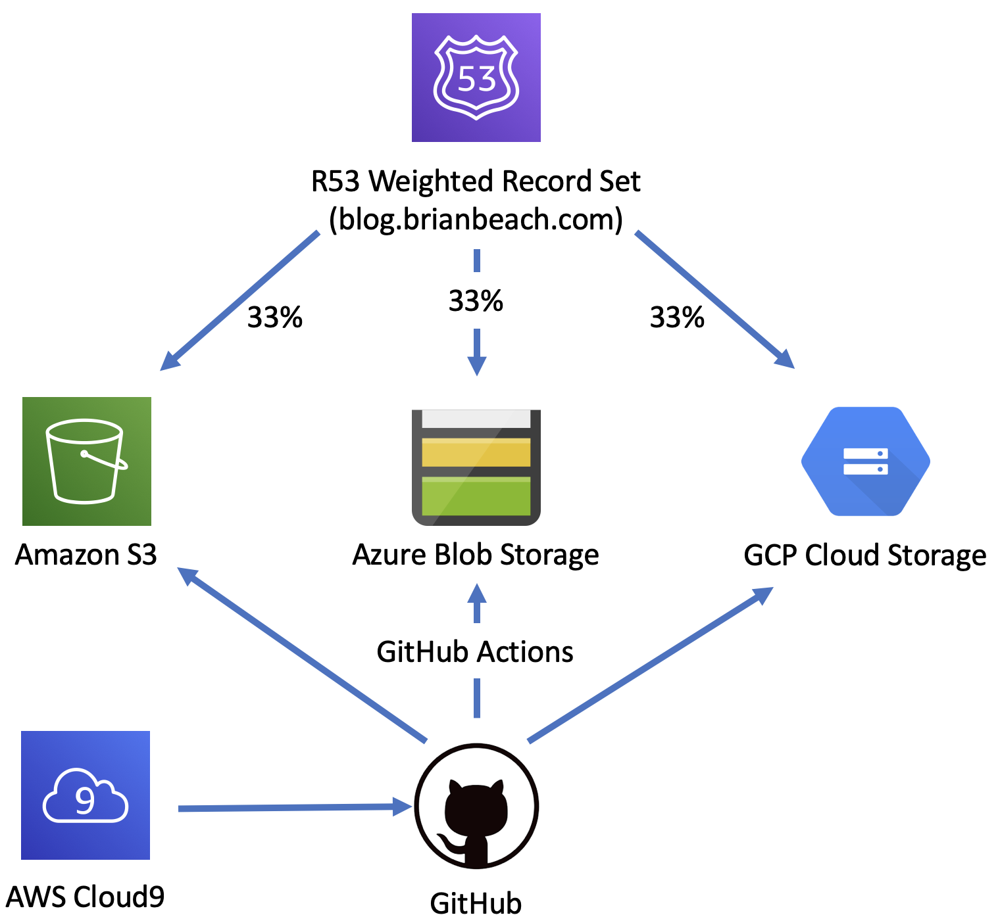
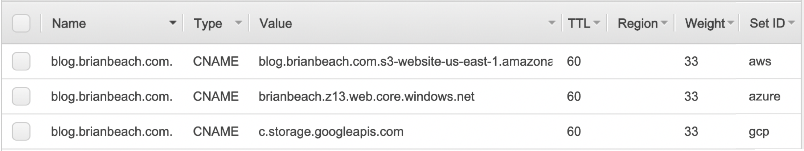
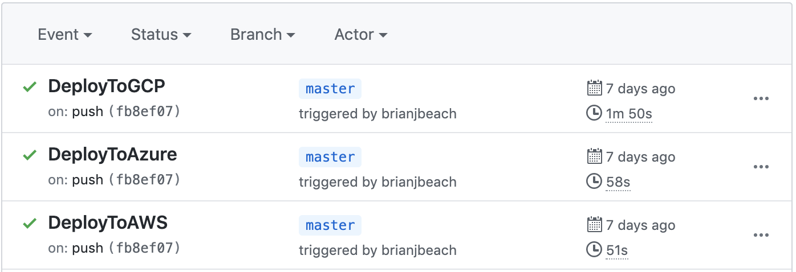

I spent some time over Thanksgiving moving my blog from Blogger to Hugo. I have
been hosting my site in an Amazon S3 bucket with an automated build in AWS 
CodeBuild. That is been running well for the past month and I have worked out 
most of the kinks. So, I decided to make my blog Multi-Cloud and host it on 
AWS, Azure, and GCP while load balancing traffic across the three platforms. 
The footer at the bottom of each page will tell you where the page is served 
from. I also moved the build process to GitHub Action so I was not dependent 
on AWS for continuous integration.

# Why?

Before we look at the architecture, let's talk about why you might want to 
host on multiple platforms. In my opinion, there is no rational reason to 
do this. Each of these platforms is way more reliable than I -- and most 
everyone else -- would ever need. Honestly, the complexity of running on multiple
platforms likely reduces my reliability. That said, I work in the industry 
and need to stay aware of the various platforms. This architecture forces
me to stay engaged in the changes in the three big cloud providers. 

# Architecture 

The overall architecture is shown in the diagram below. A Route 53 Weighted
Record Set balances traffic across Amazon S3 bucket, Azure Storage 
Account, and GCP Cloud Storage. Each of these are configured for static 
web hosting and anonymous access. Git Hub Actions are used to build a
copy of the site for each provider. I am also using a Cloud 9 instance
to edit the blog, but that is not part of the runtime experience. 



Route 53 is configured to evenly balance traffic across the three. The
configuration is shown below. The TTL is 60 seconds, so if you refresh 
the page it should change providers about every 60 seconds. That assumes 
there is only one visitor. While I would be thrilled to have many simultaneous
viewers, let's be honest, you are probably this only one right now. 



While Route 53 supports health checks, in the interest of frugality, I am 
not running any. Yes, it would only cost $1.50/month to add health checks (the 
first 50 AWS health checks are free, and Azure and GCP would cost $0.75 each), 
but I'm currently spending less than a $1/month across the three providers
and health checks would  more than double my costs. Of course, if my
blog were important, I would add the health checks and allow R53 to remove
a provider if they were having problems.

Finally, I recognize that I am dependent on Route 53 for resolution and 
therefore I have a single point of failure. I could 
add name servers from multiple providers to spread DNS across all three,
but given that R53 has a 100% SLA, that is a job for another holiday. 

# Continuous Integration

In the past, I was using AWS ClodeBuild 
(see [appspec.yaml](https://github.com/brianjbeach/blog.brianbeach.com/blob/master/buildspec.yml)) 
to render Hugo and copy the output to S3, but I didn't want to be too 
reliant on a single provider. In addition, I have been planning to learn more 
about GitHub Actions and compare it to Travis. So this was my opportunity. You 
can see the three build actions, one for each provider, 
[here](https://github.com/brianjbeach/blog.brianbeach.com/tree/master/.github/workflows).
Each time I push to master, the three build actions fire in parallel and
update the three providers. For example, here is the last build from a few 
days ago.



I wanted to have the page footer display the provider that served the page. 
A Hugo page is composed of templates called 
[Partials](https://gohugo.io/templates/partials/). You can override
the default by copying a specific template from the theme to your layouts 
folder. In this case 
[site-footer.html](https://github.com/brianjbeach/blog.brianbeach.com/blob/master/layouts/partials/site-footer.html). 
My template includes the following line.

```
You are viewing the {{ $.Site.Params.environment }} site served from {{ $.Site.Params.cloud }}.
```

The two parameters are filled in at build time from the appropriate file in 
the [Configuration Directory](https://github.com/brianjbeach/blog.brianbeach.com/tree/master/config).
For example, the [AWS file](https://github.com/brianjbeach/blog.brianbeach.com/blob/master/config/aws/config.toml)
includes the following.

```
[params]
    cloud = "Amazon Web Services"
    environment = "production"
```

The environment is specified as a command-line parameter to Hugo 
in the build action. for example.

```
hugo --environment aws
```