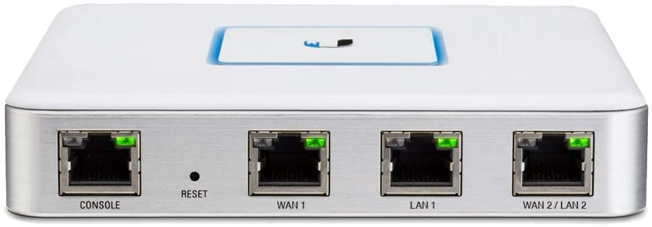
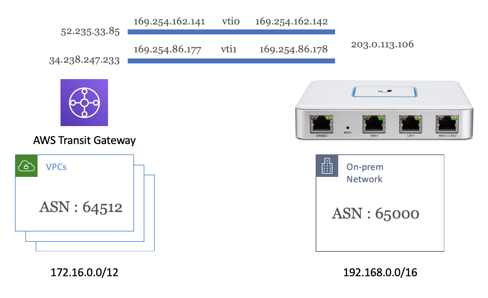
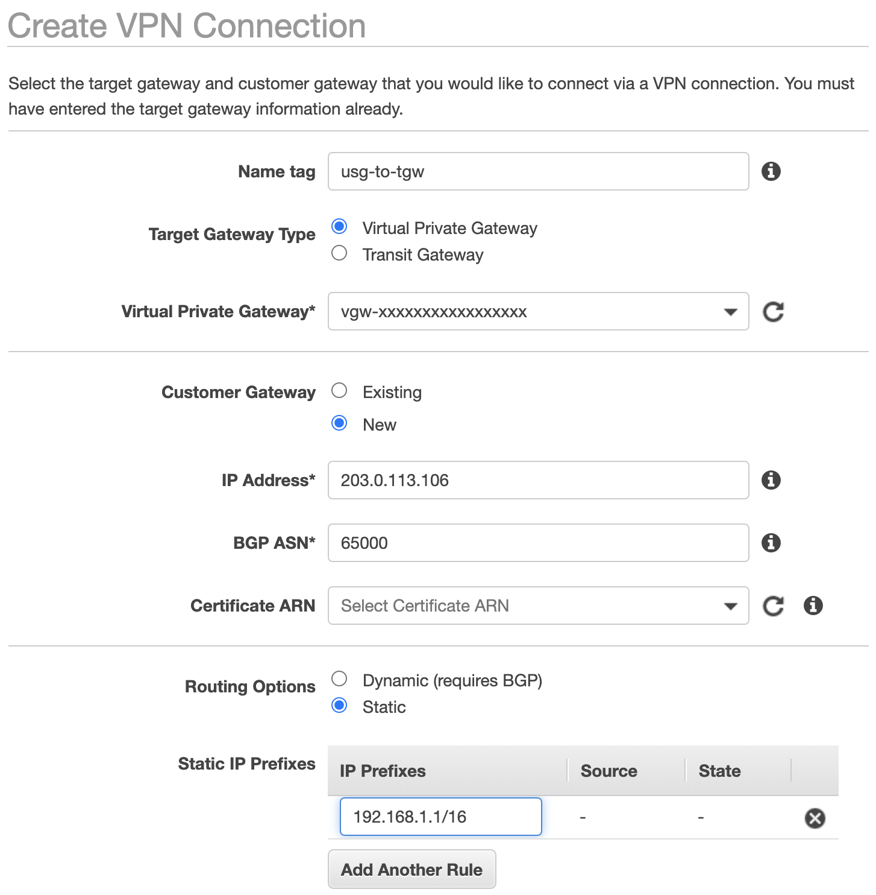
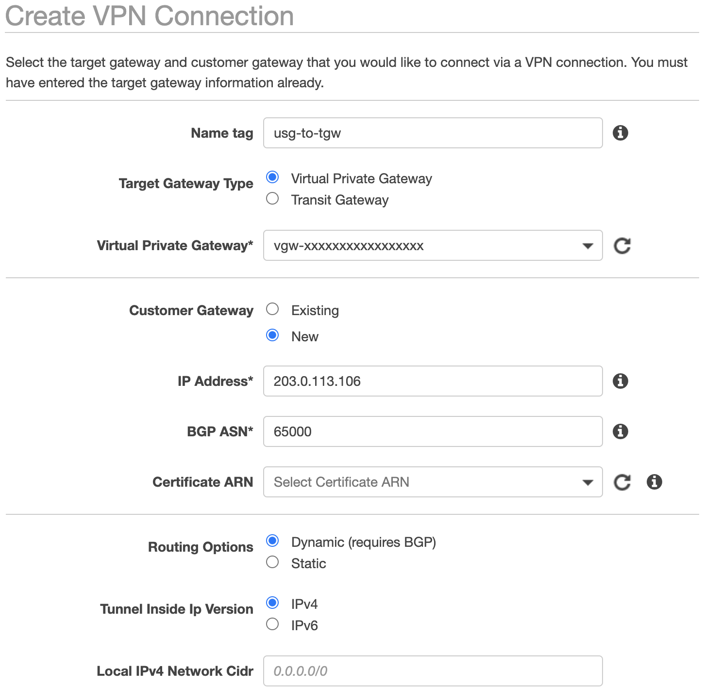

I recently upgraded my home network from the Ubiquiti EdgeRouter to the UniFi Security Gateway (USG). Similar to the EdgeRouter, the USG supports most common configuration tasks from the web UI, but advanced configuration is only available from the command line. While you can configure a VPN tunnel to AWS from the UI, it does not allow you to configure redundancy or Border Gateway Protocol (BGP). With everyone quarantined -- working and learning from home -- I have been struggling to find time to hack the router. So, with the holiday weekend upon us, I finally had time to dive in.



By the way, if you need set up a VPN on the EdgeRoute, there are instructions in the [Ubiquiti Documentation](https://help.ui.com/hc/en-us/articles/115015979787-EdgeRouter-Route-Based-Site-to-Site-VPN-to-AWS-VPC-VTI-over-IKEv1-IPsec-). This post focuses on the UniFi Security Gateway (USG) which is not documented. I am using the [USG Advanced Configuration](https://help.ui.com/hc/en-us/articles/215458888-UniFi-USG-Advanced-Configuration-Using-config-gateway-json) method to create a **config.gateway.json** file. If you want to skip the details, you can download a template for a [static](https://github.com/brianjbeach/unifi-usg-aws-vpn/blob/master/config.gateway.static.json) or [dynamic](https://github.com/brianjbeach/unifi-usg-aws-vpn/blob/master/config.gateway.dynamic.json) VPN configuration from GitHub.

## Creating the VPN Connection

In this post I am going to walk through configuring the following scenario.



Let us begin by creating a **static** VPN on the AWS Console. I specify the public IP address of my home router (203.0.113.106). I also specify the CIDR block of my home network (192.168.0.0/16) that I want to advertise to AWS. I leave all the other options with default values. 



Alternativly, I could choose to create a **dynamic** VPN. In this case I do not need to specify the CIDR block as BGP will automate this for me. This is the configuration I run. It has two advantages. First, I do not have to configure routing. BGP will automate the exchange of addresses. Second, as BGP chats back and forth, it keeps the tunnel active. If you use static routing, the tunnel will shut down if it is not being used. It takes a second or two to restabligh it when you need it again. 



Once you create the VPN, click the **Download Configuration** button, and choose the Generic vendor. You will get a text document with a ton of settings. You can ignore most of them assuming you left the default settings. The important information from my configuration is listed below.  

### IPSec Tunnel #1
* Pre-Shared Key : AuuAi5BdMDFAVeMI1jWYn8nM2A8UadpF  
* Outside IP Addresses:
  - Customer Gateway : `203.0.113.106`
  - Virtual Private Gateway	: `52.235.33.85`
* Inside IP Address
  - Customer Gateway : `169.254.162.142/30`
  - Virtual Private Gateway : `169.254.162.141/30`
* BGP Configuration Options:
  - Customer Gateway ASN : `65000`
  - Virtual Private  Gateway ASN : `64512`
  - Neighbor IP Address : `169.254.162.141`
  
### IPSec Tunnel #2
* Pre-Shared Key : BlARnmsPSxaWficPzqmRMWk93rUFTcn  
* Outside IP Addresses:
  - Customer Gateway : `203.0.113.106`
  - Virtual Private Gateway	: `34.238.247.233`
* Inside IP Addresses
  - Customer Gateway : `169.254.86.178/30`
  - Virtual Private Gateway : `169.254.86.177/30`
* BGP Configuration Options:
  - Customer Gateway ASN : `65000`
  - Virtual Private  Gateway ASN : `64512`
  - Neighbor IP Address : `169.254.86.177`

## Creating the USG Configuration

Next, we must create a **config.gateway.json** as described in [USG Advanced Configuration](https://help.ui.com/hc/en-us/articles/215458888-UniFi-USG-Advanced-Configuration-Using-config-gateway-json). This file lives on the controller. When you make changes in the UI, the USG's configuration is overwritten. If we make changes at the command line, they will be lost. By putting the configuration in the **config.gateway.json**, the controller will merge that with the UI configuration before applying the changes to the USG.

This fist thing we need to do is create the Virtual Tunnel Interface (vti) for each of the two redundent VPN tunnels. I am using `vti0` and `vti1`, but you can use any number here as long they are not already in use. If you create a tunnel in the UI it will start numbering with `vti64`, so I assume starting at 1 is safe. 

Each tunnel get's an IP address from the link local range. These are specified in the generic configuration you downloaded from AWS. They are labled **Inside IP Addresses Customer Gateway** and will be different for each VPN you create. The Firewall rules here are the default rules that are created for a tunnel when using the UI. You may want to change them. AWS recomends setting an Maximum Transmission Unit (MTU) of `1436` and so I have. 

``` json
"vti": {
    "vti0": {
        "address": [
                "169.254.162.142/30"
        ],
        "firewall": {
            "in": {
                "ipv6-name": "LANv6_IN",
                "name": "LAN_IN"
            },
            "local": {
                "ipv6-name": "LANv6_LOCAL",
                "name": "LAN_LOCAL"
            },
            "out": {
                "ipv6-name": "LANv6_OUT",
                "name": "LAN_OUT"
            }
        },
        "mtu": "1436"
    },
    "vti1": {
        "address": [
                "169.254.86.178/30"
        ],
        "firewall": {
            "in": {
                "ipv6-name": "LANv6_IN",
                "name": "LAN_IN"
            },
            "local": {
                "ipv6-name": "LANv6_LOCAL",
                "name": "LAN_LOCAL"
            },
            "out": {
                "ipv6-name": "LANv6_OUT",
                "name": "LAN_OUT"
            }
        },
        "mtu": "1436"
    }
}
```

Next we configure the IPSec tunnel. There are three parts to this: Internet Key Exchange (IKE), Encapsulating Security Payload (ESP), and Site to Site Peers.

Below is the default IKE config. The only thing you need to change here is the IPs in the name of each group. These are the **Outside IP Addresses Virtual Private Gateway**. Technically you can use any name, I am following the naming convention of a configuration generated by the UI which is IKE_PEER-IP. Also, notice that the two configurations are identical. You could create one and share it with both tunnels. However, it is possible to configure the two tunnels differently, so I decided to create a configuration for each tunnel. 

Finally note the dead peer detection (DPD) configuration. AWS recommends setting an interval of 10 seconds with three retires. USG uses a timeout rather than retries. Therefore, I set the timeout to 10x3=30s. In addition, the USG will not allow to me to set a interval below 15, therefore I cannot set the recommended 10. This is also the configuration that Ubiquiti specifies for the EdgeRouter. I call this out befause I have seen issues with intermittent drops if you do not set DPD correctly. Let me know if you are seeing issues. 

``` json
"ike-group": {
    "IKE_52.235.33.85": {
        "key-exchange": "ikev1",
        "lifetime": "28800",
        "mode": "main",
        "proposal": {
            "1": {
                "dh-group": 2,
                "encryption": "aes128",
                "hash": "sha1"
            }
        },
        "dead-peer-detection": {
            "action": "restart",
            "interval": "15",
            "timeout": "30"
        }
    },
    "IKE_34.238.247.233": {
        "key-exchange": "ikev1",
        "lifetime": "28800",
        "mode": "main",
        "proposal": {
            "1": {
                "dh-group": 2,
                "encryption": "aes128",
                "hash": "sha1"
            }
        },
        "dead-peer-detection": {
            "action": "restart",
            "interval": "15",
            "timeout": "30"
        }
    }
}
```
Next we set ESP. Again, you only need to change the IP address in the names. I am using the **Outside IP Addresses Virtual Private Gateway** by convention, but I could have used any name. Also, once again the configs are identical. I could have chosen to only create one group, and share it with both tunnels. 


``` json
"esp-group": {
    "ESP_52.235.33.85": {
        "compression": "disable",
        "lifetime": "3600",
        "mode": "tunnel",
        "pfs": "enable",
        "proposal": {
            "1": {
                "encryption": "aes128",
                "hash": "sha1"
            }
        }
    },
    "ESP_34.238.247.233": {
        "compression": "disable",
        "lifetime": "3600",
        "mode": "tunnel",
        "pfs": "enable",
        "proposal": {
            "1": {
                "encryption": "aes128",
                "hash": "sha1"
            }
        }
    }
}
```

Finally we can create the IPSec configuraiton. The important parts here are the peer IPs which are the **Outside IP Addresses Virtual Private Gateway** of the tunnel and the local-address which is your public IP or **Outside IP Addresses Customer Gateway** in the configuration file. In addition, you need to set the pre-shared secret, also known as **Pre-Shared Key** for each tunnel. Finally, you specify the IKE and ESP configurations we created above for each tunnel. 

Note the **connection-type** parameter. The accepted values are initiate and respond. USG used StrongSwan for IPSec. Initiate will result in a StrongSwan configuration of **auto=route** and respond will result in **auto=add**. Initiate means that the tunnel will come up when you send traffic across it. This means the tunnel will shut down when not in use. You may see some timeouts as the tunnel is coming back up. Respond means that the tunnel must be initiated from the AWS side. StrongSwan supports another option **auto=start** that will start the tunnel when StrongSwan starts, but that is not available from the USG configuration. Luckily, none of this matters if you are using BGP. The BGP negotiation traffic is enough to keep the tunnel active. If you are using static configuration, expect that the tunnels will be torn down if you are not suing them.

``` json
"site-to-site": {
    "peer": {
        "52.235.33.85": {
            "authentication": {
                "mode": "pre-shared-secret",
                "pre-shared-secret": "X5nSbaAf3sW1OPslaD5K8EWrJyhuRKCI"
            },
            "connection-type": "initiate",
            "ike-group": "IKE_52.235.33.85",
            "local-address": "203.0.113.106",
            "vti": {
                "bind": "vti0",
                "esp-group": "ESP_52.235.33.85"
            }
        },
        "34.238.247.233": {
            "authentication": {
                "mode": "pre-shared-secret",
                "pre-shared-secret": "O102CBFLXmmPYOIYOeAUUlmzlxPpvrRU"
            },
            "connection-type": "initiate",
            "ike-group": "IKE_34.238.247.233",
            "local-address": "203.0.113.106",
            "vti": {
                "bind": "vti1",
                "esp-group": "ESP_34.238.247.233"
            }
        }
    }
}
```
Finally, we need to set up routing. In short, we need to tell the USG what networks are available on the AWS side of the tunnel and vise-versa. I am running Border Gateway Protocol (BGP) and suggest you do the same for the reasons mentioned above. The important part here are the **169.254** addresses. These are the 'Neighbor IP Address' from the configuration file. You also need to specify the Autonomous System Number (ASN) for both sides. If you left the defaults, these should be `6500` for the **Customer Gateway ASN** and `64512` for the **Virtual Private Gateway ASN** as shown below. Finally, specify your public or **Outside IP Addresses Customer Gateway** as the router-id. 

Note that I have configured BGP to redistribute **connected** networks. This means that the USG will advertise any networks you have configured in the controller. If you have other routing protocols or static routes configured on your USG, you might want to add those here. The supported options are: connected, kernel, ospf, rip, and static.


``` json
"protocols": {
    "bgp": {
        "65000": {
            "neighbor": {
                "169.254.162.141": {
                    "remote-as": "64512",
                    "soft-reconfiguration": {
                        "inbound": "''"
                    },
                    "timers": {
                        "holdtime": "30",
                        "keepalive": "10"
                    }
                },
                "169.254.86.177": {
                    "remote-as": "64512",
                    "soft-reconfiguration": {
                        "inbound": "''"
                    },
                    "timers": {
                        "holdtime": "30",
                        "keepalive": "10"
                    }
                }
            },
            "parameters": {
                "router-id": "203.0.113.106"
            },
            "redistribute": {
                "connected": "''"
            }
        }
    }
}
```

If you choose not to run BGP, you must set up a static route to AWS. In my example, I assume that all the networks (i.e. VPCs) on the AWS side are using CIDRs from 172.16.0.0/12, and all the networks attached to my USG are using CIDRs from 192.168.0.0/16. Therefore, I am simply routing anything to 172.16.0.0/12 to the two tunnel interfaces with equal weight. Note that I configured the AWS static routing when I configured the VPN in the AWS console. See the 192.168.0.0/16 in the screenshot at the top of this post.  

``` json
"protocols": {
    "static": {
        "interface-route": {
            "172.16.0.0/12": {
                "next-hop-interface": {
                    "vti0": {
                            "distance": "30"
                    },
                    "vti1": {
                            "distance": "30"
                    }
                }
            }
        }
    }
}
```

When running BGP, you may run into issues with asymmetric routing as mentioned by Tim Keeler in the comments below. AWS will load balance traffic between the two tunnels. Therefore, you may receive traffic on a different interface than you sent it on. In some situations, those packets will be identified as "Martian Addresses" and dropped. A Martian Address means that a packet was received on an interface that is not known to be connected to a network with that address. The USG is configured with strict filtering by default. As defined in [RFC 3704 - Ingress Filtering for Multihomed Networks](https://tools.ietf.org/html/rfc3704#section-2), `strict` means that the USG will only accept the packet if it is received on an interface that has an route to that network. When you configure static routing, you explicitly add both tunnels to the route table with equal cost. Therefore, the USG will accept traffic on either interface. However, when you configure dynamic routing, BGP will select only one route to add to the route table. In this case, if traffic is received on the interface that is not in the route table, the USG will drop the packet. 

There are a bunch of ways to fix this. First, you should be able to configure BGP to add more than one route to the table just like we did with static routing. However, it seems that is [not supported on the USG](https://community.ui.com/questions/Error-on-USG-trying-to-set-BGP-maximum-paths/51d385bf-78c2-4ccd-939c-55e8565375b5). Second, if you have a Transit Gateway (TGW) configured on the AWS side, you can disable **Equal Cost Multipath (ECMP)**. *Note that is not supported with a Virtual Private Gateway (VPG).* Third, you can change the default behavior of the USG to allow Martian Addresses as shown below. Here I am changing `source-validation` from `strict` (default) to `loose`. Loose means that the USG will accept packets if the source address is in the route table for ANY interface. You can also `disable` source-validation so that the USG does not check at all. Personally, I prefer to disable ECMP on the TGW than to reduce security. Given the USG is only a 1Gpbs device, there is likely no performance gain from using ECMP anyway. Therefore, the configurations on GitHub do not change source-validation. 

```
"firewall": {
        "source-validation": "loose"
}
```


I have put all the pieces together on Github. You can download a template for a [static](https://github.com/brianjbeach/unifi-usg-aws-vpn/blob/master/config.gateway.static.json) or [dynamic](https://github.com/brianjbeach/unifi-usg-aws-vpn/blob/master/config.gateway.dynamic.json) VPN configuration. Just search for the **{{params}}** and replace them with the values from your configuration file. Then, copy the configuration to **config.gateway.json** as described in [USG Advanced Configuration](https://help.ui.com/hc/en-us/articles/215458888-UniFi-USG-Advanced-Configuration-Using-config-gateway-json).
