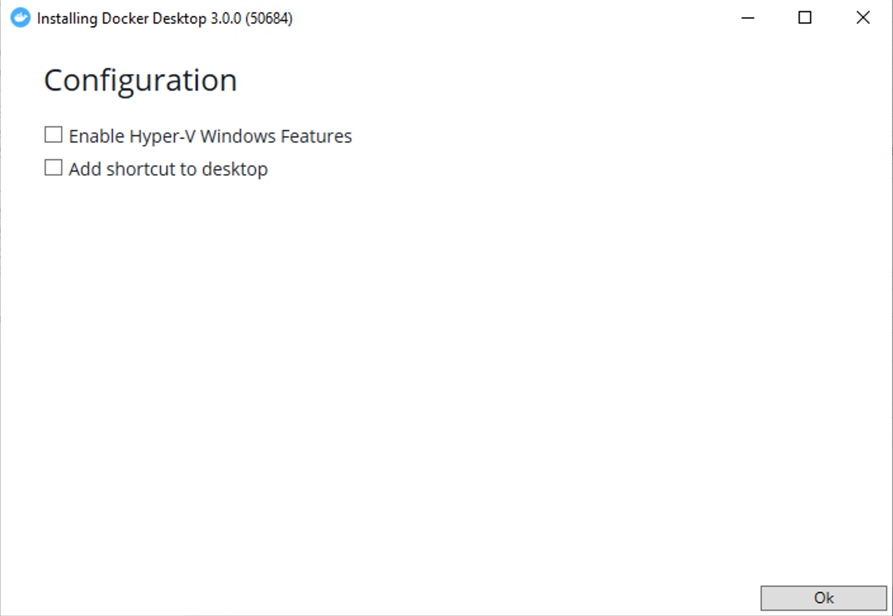
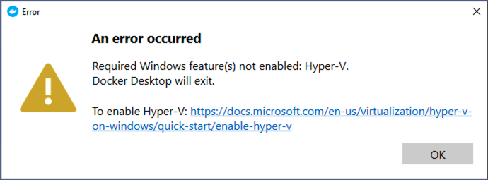
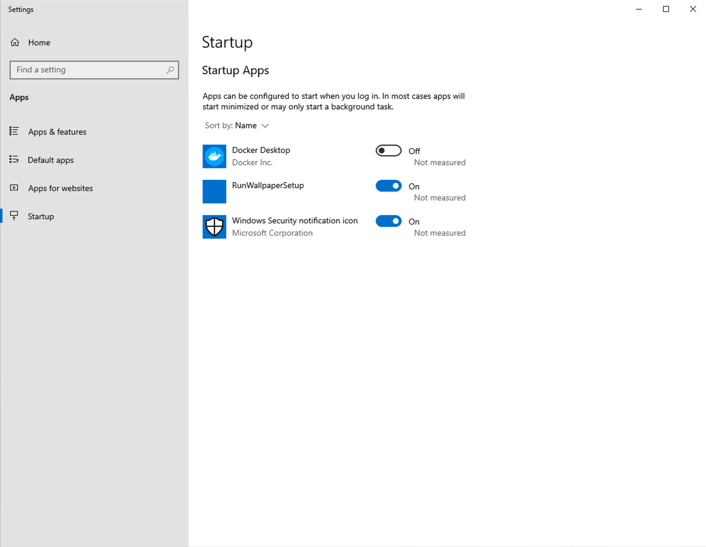
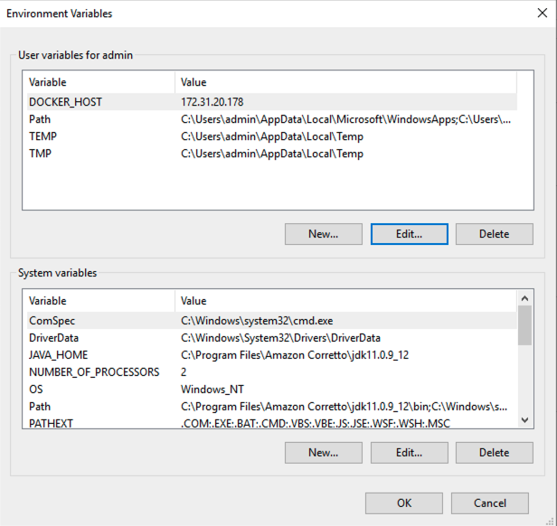
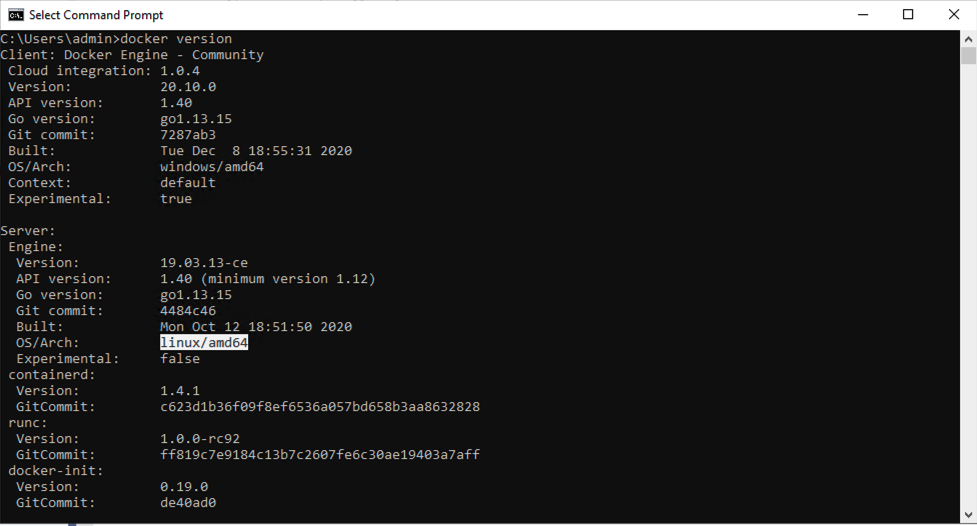
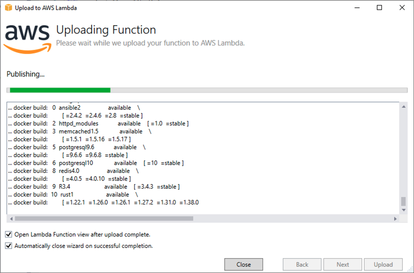

In the post, I will show you how to build a Linux container in Visual Studio running on a EC2 Windows Instance. 

The [AWS Toolkit for Visual Studio](https://aws.amazon.com/visualstudio/) allows you to deploy your project to Elastic Container Service (ECS) Fargate and recently as a container image to AWS Lambda among other options. In both of these cases, you must build a Linux container from Visual Studio or the dotnet command line. If you are working in Visual Studio on Windows, Docker Desktop uses a Linux container running in Hyper-V to build the container. Unfortunately, Hyper-V does not run on EC2 Instances (though it will run on EC2 bare metal).

Docker employs a client/server architecture where the server, dockerd, typical runs as a daemon on Linux. By default, the docker command line client talks to the dockerd service on the same host a local [file descriptor](https://en.wikipedia.org/wiki/File_descriptor) `fd://`. However, is also supports other connection methods including tcp. You can add a --host or -H to the dockerd command when you start the server. For example `dockerd -H tcp://0.0.0.0` instructs the Docker service to listen on all IP addresses. 

Note that, as described  [in the Docker documentation](https://docs.docker.com/config/daemon/), you should set up mTLS to authenticate requests. I am using an VPC Security Group to control access to the Linux server from my Windows client.

Assuming that dockerd is running as a daemon, we can override the default options used when calling `service docker start` by creating a `/etc/systemd/system/docker.service.d/options.conf` file to override the defaults that looks like this:

```
[Service]
ExecStart=
ExecStart=/usr/bin/dockerd -H fd:// -H tcp://0.0.0.0 --containerd=/run/containerd/containerd.sock $OPTIONS $DOCKER_STORAGE_OPTIONS $DOCKER_ADD_RUNTIMES
```

I have created an EC2 userdata script that also installs and configures docker.

```
#! /bin/bash
amazon-linux-extras install docker
mkdir /etc/systemd/system/docker.service.d
cat << 'EOF' > /etc/systemd/system/docker.service.d/options.conf 
[Service]
ExecStart=
ExecStart=/usr/bin/dockerd -H fd:// -H tcp://0.0.0.0 --containerd=/run/containerd/containerd.sock $OPTIONS $DOCKER_STORAGE_OPTIONS $DOCKER_ADD_RUNTIMES
EOF
systemctl daemon-reload
service docker start
usermod -a -G docker ec2-user
```

Once the Linux server is running, I can install Docker Desktop on the Windows client. I disable the **Enable Hyper-V Features**  during the installation.

 

Despite that, you will still get an error on reboot. 

 

This does not really matter since we are going to offload docker to the Linux server. Therefore, I just disable running Docker Desktop on startup.

 

Now, all I have to do is set an environment variable named **DOCKER_HOST** to tell the client where the server is running. 

 

Now I can run docker commands on the client and they are executed on the server.

 

Docker builds also work in visual studio. 



A special thanks to [Vlad Hrybok](https://www.linkedin.com/in/vladhrybok/) for bringing this to my attention. 