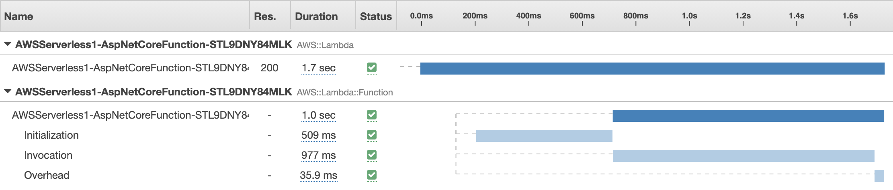
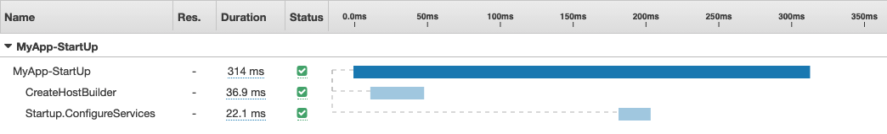
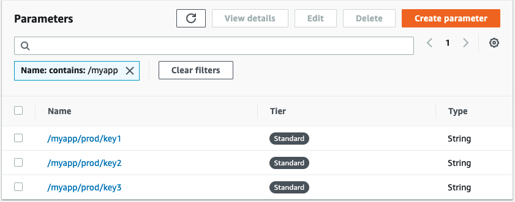
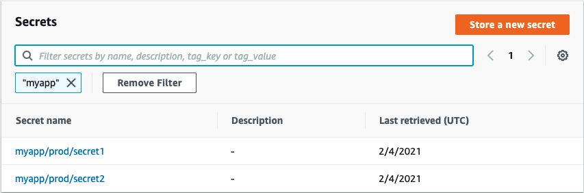
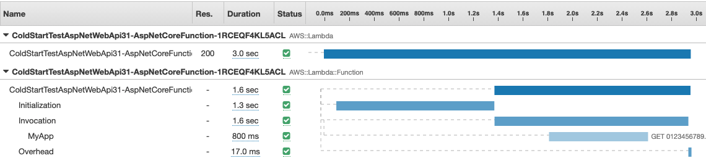
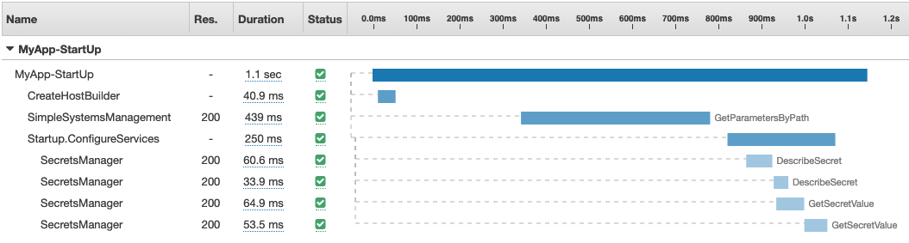

The ability to host an [ASP.NET project in AWS Lambda](https://github.com/aws/aws-lambda-dotnet/tree/master/Libraries/src/Amazon.Lambda.AspNetCoreServer) is a great way to get started with serverless. However, cold starts can result in a slow first invocation of the ASP.NET function. In this post I'll set up a typical, albeit simple, application to gather benchmarks. In part two, I will explore a few options to speed up initialization. 

## Background

A Lambda function is fundamentally different from a traditional application. Most important to the topic of Cold Starts is how an application is initialized. On a traditional web server, the application is initialized before it goes into service. The first invocation may be a little slower as caches warm up, but the application itself was already running. In Lambda, the application is initialized when the first invocation arrives. The request is enqueued, Lambda copies your application into a container, initializes the application, and then forwards the request to the container. The same thing happens as Lambda scales out and adds new containers. For subsequent invocations the application is already running the response is much faster. Often one or two orders of magnitude faster. 

There are few important factors in how quickly your function will launch. First, the larger the package (zip file) the longer it will take to copy. We can control package size by being diligent. For example, we may serve static content from S3 rather than the Lambda function. Second, byte code languages like Java and .NET need to be compiled into native code at startup. We can mitigate this by using the ReadyToRun flag in .NET to create native machine code during initial compilation. Third, the more initialization you do at startup the longer it will take. This is not unique to .NET and impacts every language. We can address this by being smart about how we retrieve secrets and other data at startup. 

## Baseline

Before we get started, let's get some basic numbers to set the stage. There is a table summarizing this at the bottom of the page. A simple hello world application in NodeJS takes about 150ms to initialize and 20ms to invoke. By comparison, a similar hello world application written in .NET, but not using ASP.NET, takes about 180ms to initialize and 250ms to invoke. So, initialization time is a slightly longer, but the first invocation is about 10x longer. 

For the rest of this post, I am going to focus on an ASP.NET application.  I created a simple WebAPI project using the `serverless.AspNetCoreWebAPI` template included in the [AWS Toolkit for Visual Studio](https://aws.amazon.com/visualstudio/). I launched it with a simple right click "Deploy to Lambda" and enabled X-Ray Active Tracing in Lambda. Here is what X-Ray captured.



As you can see, the first request took about 1.7s. Roughly 500ms to initialize and 1000ms to serve the first invocation. This is typical of an ASP.NET function. Note that subsequent invocations typically take about 50ms. A huge improvement. 

I added some additional instrumentation to the ASP.NET Startup so see what is happening during the initialization phase. I explain how to do that below. I also explain why a roughly 60ms call to `Startup.Configure` is missing from the timeline. Therefore, it takes about 314ms + 60ms = 374ms for the ASP.NET startup process. I will assume the difference between what Lambda reports (509ms) and what we see in ASP.NET (375ms) is the time required to copy the package into the Lambda container (134ms).  



This is a good start, but this function is still comically simple. It does nothing during initialization. Let's assume we need some configuration from Parameter Store and Secrets Manager at startup. In addition, we can add more detailed instrumentation using X-Ray to get further insight into what is happening. Let's do that now.

## Parameter Store

In parameter store I created three parameters as follows. Note that I have organized all three secrets using the path /myapp/prod/*. This allows me get them all in one call rather than making three round trips to get each parameter. That is a common best practice.



I am using the [Amazon.Extensions.Configuration.SystemsManager](https://github.com/aws/aws-dotnet-extensions-configuration) package to import the parameters. The sample project will have two entry points. LambdaEntryPoint is called when running in Lambda and LocalEntryPoint is called when debugging your code locally using Kestrel. The Lambda entry point looks like this.


```csharp
public class LambdaEntryPoint : Amazon.Lambda.AspNetCoreServer.APIGatewayProxyFunction
{

    protected override void Init(IWebHostBuilder builder)
    {
        builder.UseStartup<Startup>();
    }

    protected override void Init(IHostBuilder builder)
    {
        builder.ConfigureAppConfiguration((hostingContext, config) =>
        {
            config.AddSystemsManager("/myapp/prod");
        });
    }
}
```

And the local entry point looks like this. 

```csharp
public static IHostBuilder CreateHostBuilder(string[] args) =>
    Host.CreateDefaultBuilder(args)
        .ConfigureWebHostDefaults(webBuilder =>
        {
            webBuilder.UseStartup<Startup>();
        }).ConfigureAppConfiguration((hostingContext, config) =>
        {
            config.AddSystemsManager("/myapp/prod");
        });
}
```

## Secrets Manager 

Next, I added two secrets. 



I am using the [AWSSDK.SecretsManager.Caching](https://github.com/aws/aws-secretsmanager-caching-net) package to manage secrets. It will cache the secrets locally for a period of time (one hour by default) so that every request is not a round trip to Secrets Manager. Again, this is best practice for any .NET application that uses Secrets Manager.

I load the two secrets in the `ConfigureServices` method of **Startup.cs** and register them with dependency injection. Note that Secrets Manager does not allow you to get a group of secrets in one call like parameter store. Therefore, I am making two asynchronous calls and then calling `WaitAll` so they can run in parallel. 

```csharp
public void ConfigureServices(IServiceCollection services)
{
    var cache = new SecretsManagerCache();
    var secret1 = cache.GetSecretString("myapp/prod/secret1"); 
    var secret2 = cache.GetSecretString("myapp/prod/secret2"); 
    services.AddSingleton<SecretsManagerCache>(cache);
    Task.WaitAll(secret1, secret2);

    // Do something with the secrets here (e.g. connect to database)

    services.AddControllers();
}
```

## X-Ray

Finally, I want to use X-Ray to trace both the initialization process and subsequent invocation to see what is actually happening under the hood. It turns out that you cannot trace the initialization process in Lambda. The X-Ray daemon provided by Lambda does not start listening until after initialization is complete. Therefore, I am only instrumenting the local entry point. I begin a new X-Ray segment as soon as the application starts. I also call `RegisterXRayForAllServices` so X-Ray will trace the calls to Parameter Store and Secrets Manager. 

```csharp
public static void Main(string[] args)
{
    Amazon.XRay.Recorder.Core.AWSXRayRecorder.Instance.BeginSegment("MyApp-StartUp");
    Amazon.XRay.Recorder.Handlers.AwsSdk.AWSSDKHandler.RegisterXRayForAllServices();
    var host = CreateHostBuilder(args).Build();
    Amazon.XRay.Recorder.Core.AWSXRayRecorder.Instance.EndSegment();
    host.Run();
}
```

Note that I split the typical `CreateHostBuilder(args).Build().Run()` across two lines in the code above. I need to end the trace before calling `Run` because `Run` does not return until you stop the Kestrel web server. Also, note that `Startup.Configure` is not called until after I call `Run`. Therefore, it will not be included in the trace. I will use a simple `StopWatch` to track that later.

I am also going to slightly modify the structure of `CreateHostBuilder` so I can capture this as an X-Ray subsegment. Be sure to call `EndSubsegment` before returning the HostBuilder object. 


```csharp
public static IHostBuilder CreateHostBuilder(string[] args)
{
    Amazon.XRay.Recorder.Core.AWSXRayRecorder.Instance.BeginSubsegment("CreateHostBuilder");

    var builder = Host.CreateDefaultBuilder(args)
            .ConfigureWebHostDefaults(webBuilder =>
            {
                webBuilder.UseStartup<Startup>();
            }).ConfigureAppConfiguration((hostingContext, config) =>
            {
                config.AddSystemsManager("/myapp/prod");
            });

    Amazon.XRay.Recorder.Core.AWSXRayRecorder.Instance.EndSubsegment();

    return builder;
}
```

Similarly, I am going to instrument my `Startup.ConfigureService` as another subsegment. 

```csharp
public void ConfigureServices(IServiceCollection services)
{
    Amazon.XRay.Recorder.Core.AWSXRayRecorder.Instance.BeginSubsegment("Startup.ConfigureServices");

    var cache = new SecretsManagerCache();
    var secret1 = cache.GetSecretString("myapp/prod/secret1"); 
    var secret2 = cache.GetSecretString("myapp/prod/secret2"); 
    services.AddSingleton<SecretsManagerCache>(cache);
    Task.WaitAll(secret1, secret2);

    // Do something with the secrets here (e.g. connect to database)

    services.AddControllers();

    Amazon.XRay.Recorder.Core.AWSXRayRecorder.Instance.EndSubsegment();
}
```

As I mentioned above, `Startup.Configure` is called outside of my X-Ray trace. Therefore, I am adding a simple `StopWatch` to time the execution. Note that I also call `app.UseXray'. This is needed to trace invocations of the function after initialization is complete. In other words, it has nothing to do with tracing the initialization process. 


```csharp
public void Configure(IApplicationBuilder app, IWebHostEnvironment env)
{
    var timer = new Stopwatch();
    timer.Start();

    app.UseXRay("MyApp", Configuration);

    if (env.IsDevelopment())
    {
        app.UseDeveloperExceptionPage();
    }

    app.UseHttpsRedirection();
    app.UseRouting();
    app.UseAuthorization();
    app.UseEndpoints(endpoints =>
    {
        endpoints.MapControllers();
    });

    Console.WriteLine($"Startup.Configure completed in {timer.Elapsed.TotalMilliseconds}ms");

}
```

## Results

After redeploying and invoking my application in Lambda, I get the following in X-Ray. With all the changes I made, the total response time has gone from about 1.7s to 3.0s. Nearly double. We know that 1.3s was spent in the initialization phase, but it's not clear what is actually happing during startup. Remember that X-Ray does not capture details of function Initialization in Lambda. 



I can run the application in local mode and see the additional instrumentation we added. I am running this on an EC2 instance in the same region as the Lambda function would run. Admittedly, this is not identical to running it in Lambda, but it is a good proxy for the real thing. Here is the output from one of the runs. 



I ran this a few times and 1100ms is about average. I have also seen an average of about 60ms for the `Startup.Configure` which is not included in the timeline. Therefore, we can assume 1300ms - 1160ms = 140ms is the time to copy the package (zip file).

Here is a quick summary of all the tests we ran for easy comparison.

| Package | Size  | Initialization | 1st Invocation |
| :---: | :---: | :---: | :---: |
| Node JS w/o lookups | 300B  | 150ms | 20ms |
| Native .NET  w/o lookups | 43KB | 180ms | 250ms |
| ASP.NET w/o lookups | 149KB | 509ms | 977ms |
| ASP.NET with lookups  | 1.2MB | 1300ms | 1600ms |

## Next Steps

Now that I have established a good baseline, I can work on improving it. I have a few hypotheses that I'll test in the next post. 