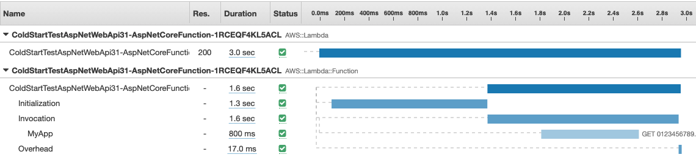
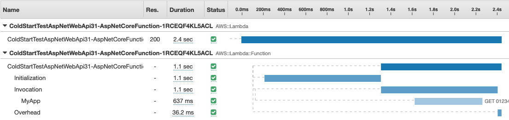
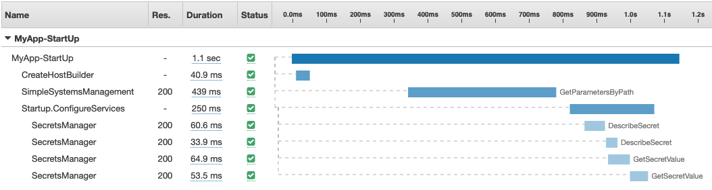
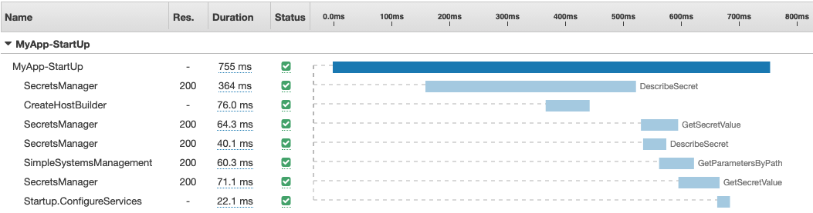
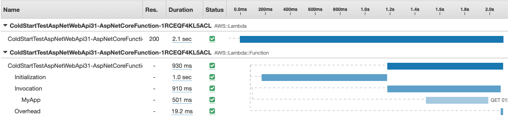
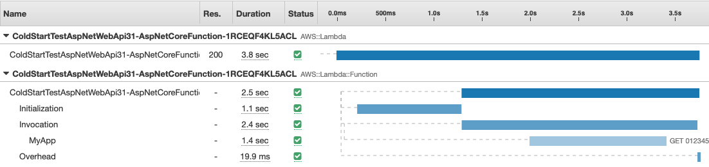
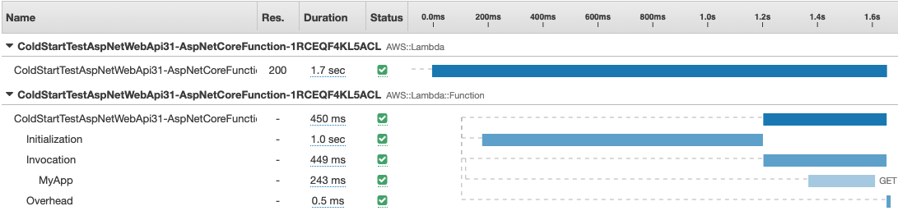

In the prior post, I looked at what happens the first time an ASP.NET application is invoked in Lambda. When we left off, we had a roughly 3 second initial response time. 



## ReadyToRun

As I mentioned earlier, one cause of long cold start times in .NET is Just In Time (JIT) compilation. As each .NET assembly is loaded, the runtime converts the Intermediate Language (IL) into machine code for the specific platform it is running on. ReadyToRun tells the compiler to generate machine code at compile time. This allows us to skip that step during initialization. Note that you must compile on the same platform you plan to run on. Therefore, we must build on a Linux machine for this to work in Lambda. I am using CodeBuild to build my project. I can enable ReadyToRun by adding the following to the PropertyGroup of my project file. 

```
    <PublishReadyToRun>true</PublishReadyToRun>
```

After redeploying, you can see that I have reduced my cold start from about 3.0s to 2.4s or about 20% improvement. Interestingly, most of that time came from the Invocation rather than Initialization. Remember that .NET is loading assemblies as they are needed. So it's not surprising that it continues to compile IL code through the first execution. However, the slight reduction in Initialization suggests there is another cause to investigate. 



Note that I have read reports that disabling `TieredCompilation` will cause the response times to settle more quickly with less jitter.  I have not researched this in depth, but the few tests I conducted did not show meaningful improvements. 

## ASP.NET Startup

Let's return to the timeline we created of the startup process in the prior post. Notice that a good portion of the time is spent waiting for calls to Secrets Manager and Parameters Store to complete. `ConfigureServices` cannot begin until the configuration is loaded from Parameters Store (about 800ms into the startup). In addition, the two calls to Secrets Manager appear to represent most of the time spent in `ConfigureServices`. It seems logical that fetching that data earlier in the startup process would improve performance. 



## Secrets Manager

Let's start with Secrets Manager. Remember, from the prior post, that we are create a new cache client in `ConfigureServices` and fetch two secrets. What if we fetched those secrets as soon as the application starts? This is probably a good time to refactor the code and introduce a Secret Repository to centralize the logic in one place as described in [Sepehr Samiei's Blog Post](https://aws.amazon.com/blogs/security/how-to-use-aws-secrets-manager-client-side-caching-in-dotnet/).


```csharp
public class SecretsRepository
{

    public static SecretsRepository Instance {get; set;}

    private readonly IAmazonSecretsManager secretsManager;
    private readonly SecretsManagerCache cache;

    public SecretsRepository()
    {
        this.secretsManager = new AmazonSecretsManagerClient();
        this.cache = new SecretsManagerCache(this.secretsManager);
    }

    public void Dispose()
    {
        this.secretsManager.Dispose();
        this.cache.Dispose();
    }

    public async Task<String> GetSecretString(string secretId)
    {
        return await this.cache.GetSecretString(secretId);
    }

    public async Task<byte[]> GetSecretBinary(string secretId)
    {
        return await this.cache.GetSecretBinary(secretId);
    }
}
```

Notice that I added a static `Instance` property to the class. I am going to create the cache so early in the startup process that dependency injection is not created yet. I'll use the static property to hold the cache temporarily until we need it. I create the cache in the `Init` method of `LambdaEntryPoint` class.


```csharp 
protected override void Init(IHostBuilder builder)
{
    // Let's start warming up the cache as soon as we launch
    SecretsRepository.Instance = new SecretsRepository();
    SecretsRepository.Instance.GetSecretString("myapp/prod/secret1")
        .ContinueWith(s => { Console.WriteLine($" Secret1 is warm."); });    
    SecretsRepository.Instance.GetSecretString("myapp/prod/secret2")
        .ContinueWith(s => { Console.WriteLine($" Secret2 is warm."); });

    builder.ConfigureAppConfiguration((hostingContext, config) =>
    {
        config.AddSystemsManager("/myapp/prod");
    });
}
```

I also put identical code in the `Main` method of `LocalEntryPoint` class.

```csharp
public static void Main(string[] args)
{
    Amazon.XRay.Recorder.Core.AWSXRayRecorder.Instance.BeginSegment("MyApp-StartUp");
    Amazon.XRay.Recorder.Handlers.AwsSdk.AWSSDKHandler.RegisterXRayForAllServices();

    // Let's start warming up the cache as soon as we launch
    SecretsRepository.Instance = new SecretsRepository();
    SecretsRepository.Instance.GetSecretString("myapp/prod/secret1")
        .ContinueWith(s => { Console.WriteLine($" Secret1 is warm."); });
    SecretsRepository.Instance.GetSecretString("myapp/prod/secret2")
        .ContinueWith(s => { Console.WriteLine($" Secret2 is warm."); });

    var host = CreateHostBuilder(args).Build();
    Amazon.XRay.Recorder.Core.AWSXRayRecorder.Instance.EndSegment();
    host.Run();
}
```
By the time the `ConfigureServices` method is called, the cache is already warm. I can simply grab the prewarmed cache from the static `Instance` property, add it to dependency injection, and read the secret values. If, for some reason, the cache is not warm yet, the calls to `GetSecretString` will either wait for the prior request to complete, or start a new request. 

```csharp
public void ConfigureServices(IServiceCollection services)
{
    Amazon.XRay.Recorder.Core.AWSXRayRecorder.Instance.BeginSubsegment("Startup.ConfigureServices");

    // Get the secrets from the warm cache
    services.AddSingleton<SecretsRepository>(SecretsRepository.Instance);
    var secret1 = SecretsRepository.Instance.GetSecretString("myapp/prod/secret1").Result;
    var secret2 = SecretsRepository.Instance.GetSecretString("myapp/prod/secret1").Result;

    // Do something with the secrets here (e.g. connect to database)

    services.AddControllers();

    Amazon.XRay.Recorder.Core.AWSXRayRecorder.Instance.EndSubsegment();
}
```

I compile and run that on my EC2 instance because I want to see the details of the startup timeline. As you can see, this version took 755ms, down from 1100ms in the original version. We know that roughly 100ms came from JustInTime compilation, so we can assume prewarming the cache reduced initialization by a little more than 200ms. That is not surprising since the four calls to Secrets Manager in the timeline above took about 200ms. 




Deploying that to Lambda, my total cold start is now at about 2.1s. Down from 3.0s at the beginning of this post. The combination of ReadyToRun an d fetching secrets a little early cut out cold start time by about 30%. Not bad. 




## Memory and CPU
 
So far, I have been running all my tests with 256MB of Memory. Lambda reports the max memory used at the end of each run. On the last run, I used 126MB suggesting I could dial it down. However, the CPU allocated is directly tied to the amount of memory. Therefore reducing memory could cause my function to start slower. Let's test it 128MB. As you can see that caused my startup time to nearly double at 3.8 seconds. 



Could we decrease the cold start time by adding memory. Let's test again at 512MB. As you can see it dropped to 1.7s. That's down from 2.1s. 



If we continue doing this, I get smaller and smaller gains. The table below summarizes a few runs. These are single data points and probably have some jitter (e.g. initialization at 1024MB). I should be running a series of tests and averaging them, but I did not do that.

| Memory | Initialization | Invocation | Total |
| :---: | :---: | :---: | :---: |
| 128 | 1.1s | 2.4m | 3.8s |
| 256 | 1.0s | 910ms | 2.1s |
| 1024 | 1.2s | 213ms | 1.5s |
| 2048 | 978ms | 115ms | 1.2s |

Interestingly, an obvious pattern is emerging. Increasing CPU has a much bigger impact on the first Invocation time than it does on the Initialization. Increasing Memory by 16X only bought an 11% improvement in Initialization while it bought us a 95% improvement on first Invocation.

## Parameter Store

What about Parameter Store. I had assumed loading the parameters a little earlier would help just like it did for secrets. I have tried [updating the Parameter Store Extension to pre-fetch secrets](https://github.com/brianjbeach/aws-dotnet-extensions-configuration/tree/prefetch). However, I have not been able to show a significant improvement and have not submitted a pull request. It appears that building the ASP.NET host takes enough time that Lambda can fetch the parameters without delaying the build phase. Let me know if you find different. 

