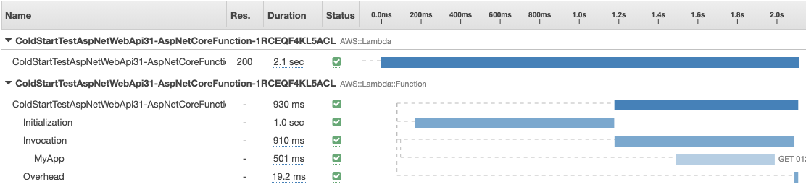

In this final post I'll list a few additional optimizations for reducing the first invocation times. See part [one](/posts/2021-02-05-lambda-cold-start-part-1/) and [two](/posts/2021-02-06-lambda-cold-start-part-2/) for more details. 

## Burst CPU

According to [this video](https://www.youtube.com/watch?v=EML6FKBdsNU&t=2134s) Lambda functions get additional CPU during the initialization phase. That extra CPU can help with JIT compilation but .NET lazy compiles code as it encounters it. Therefore, the function handler is not compiled until it's executed, which is after the CPU is constrained. 

So, we really want to exercise as much of the application as we can during initialization. As a test, I simply invoke a the function handler from the entry point. Obviously you would only want to make a non-mutating call here. 

```csharp
public class LambdaEntryPoint : APIGatewayProxyFunction
{
    public LambdaEntryPoint() : base()
    {
        var request = new APIGatewayProxyRequest();
        request.HttpMethod = "GET";
        request.Path = "api/values";
        this.FunctionHandlerAsync(request, null);
    }
}
```

That probably sounds counterintuitive. Adding an extra call during startup should add additional time. However the extra CPU can help reduce our overall time. If we start with the timeline from end of the part 2 blog post. 



You can see in the timeline below that we have reduced the overall execution time by 20% by adding the extra invocation during initialization. 


20% is great, but the really important part is that we reduced the invocation phase by 70%. That is huge. If we combine this provisioned concurrency, our first invocation would be only 262ms.  

## Ahead-of-time JIT Compilation for System Dependencies

The last trick I have picked up is the AWS_LAMBDA_DOTNET_PREJIT environment variable. There was a flag introduced with Provisioned Concurrency that causes Lambda to pre-warm these .NET libraries while your code is being downloaded to the container. By default, this only occurs if you have provisioned concurrency enabled. However, you can add an environment variable AWS_LAMBDA_DOTNET_PREJIT=Always to get the same benefit in standard functions. 

## Summary

When I combine all the tricks introduced in this post with provisioned concurrency, I was able to reduce cold start from 3 seconds to about 260ms. That's about a 90% reduction overall. 

