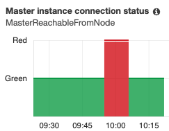

I have been working on multi-tenant OpenSearch (a.k.a. Open Distro for ElasticSearch) project. This article (https://www.elastic.co/blog/found-multi-tenancy) (from 2015) outlines a few isolation models and the issues you are likely to hit with each. Below I look at two options: one index per tenant and multiple tenants per index with document level security -- a feature of OpenSearch. 

## Provisioning

I created a simple single-node Elasticsearch cluster on a t3.small. This is really small but I want to put pressure on the system and see how it scales.  In the samples below, assume the VPC endpoint is https://vpc-test-xxxxxx.us-east-1.es.amazonaws.com and the username:password is admin:password.

## Index Per Tenant

Creating one index per tenant is a simple solution for isolation. However, it seems to have performance issues relatively quickly. 

First, I create 10 tenants and a user for each. I assign that user unlimited rights within the tenant, and a few sample records.


```bash
## Create 10 Tenants
for tenant in $(seq -f "%06g" 1 10); do 
  echo "\nCreating Tenant $tenant"
  curl -X PUT -u 'admin:password' "https://vpc-test-xxxxxx.us-east-1.es.amazonaws.com/index-$tenant"
  curl -X PUT -u 'admin:password' "https://vpc-test-xxxxxx.us-east-1.es.amazonaws.com/_opendistro/_security/api/roles/role-$tenant" -H 'Content-Type: application/json' --data '{"index_permissions": [{"index_patterns": ["index-'$tenant'"],"allowed_actions": ["unlimited"]}]}'
  curl -X PUT -u 'admin:password' "https://vpc-test-xxxxxx.us-east-1.es.amazonaws.com/_opendistro/_security/api/internalusers/user-$tenant" -H 'Content-Type: application/json' --data '{"password": "password"}'
  curl -X PUT -u 'admin:password' "https://vpc-test-xxxxxx.us-east-1.es.amazonaws.com/_opendistro/_security/api/rolesmapping/role-$tenant" -H 'Content-Type: application/json' --data '{"users":["user-'$tenant'"]}'
  curl -X PUT -u 'admin:password' "https://vpc-test-xxxxxx.us-east-1.es.amazonaws.com/index-$tenant/_doc/1" -H 'Content-Type: application/json' --data '{"name": "t'$tenant'd000001", "description": "Tenant '$tenant', Record 000001"}' 
  curl -X PUT -u 'admin:password' "https://vpc-test-xxxxxx.us-east-1.es.amazonaws.com/index-$tenant/_doc/2" -H 'Content-Type: application/json' --data '{"name": "t'$tenant'd000002", "description": "Tenant '$tenant', Record 000002"}' 
  curl -X PUT -u 'admin:password' "https://vpc-test-xxxxxx.us-east-1.es.amazonaws.com/index-$tenant/_doc/3" -H 'Content-Type: application/json' --data '{"name": "t'$tenant'd000003", "description": "Tenant '$tenant', Record 000003"}' 
done
```

Running on a single t3.small.elasticsearch instance, I start to see retries around the ninth index. By the tenth I was getting gateway errors from curl.  You can see reachability issues in CloudWatch curing this period. 



The [2015 article](https://www.elastic.co/blog/found-multi-tenancy) suggests we would see memory issues with one tenant per index. However, while memory pressure increased, it still seems ok. Not sure what the limit is here but it clearly not scaling well. 


Once it recovers I ran some tests. Note I only ran the first 9 indexes (the tenth failed to create). All passed!

```bash
for user in $(seq -f "%06g" 1 9); do 
  for index in $(seq -f "%06g" 1 10); do 
    http_response=$(curl -X GET -u 'user-'$user':password' 'https://vpc-test-xxxxxx.us-east-1.es.amazonaws.com/index-'$index'/_doc/1' -o /dev/null --silent -w "%{http_code}")
    if [[ "$user" == "$index" ]]; then
      if [[ "$http_response" != "200" ]]; then echo "ERROR: user $user should have access to index $index but does not. HTTP response code was $http_response"; fi
    else
      if [[ "$http_response" != "403" ]]; then echo "ERROR: user $user should not have access to $index but does. HTTP response code was $http_response"; fi
    fi
  done
done
```

I have script to clean up the test indexes I created.

```bash
## Delete 10 Tenants 
for tenant in $(seq -f "%06g" 1 10); do 
  echo "\nDeleting Tenant $tenant"
  curl -X DELETE -u 'admin:password' "https://vpc-test-xxxxxx.us-east-1.es.amazonaws.com/_opendistro/_security/api/roles/role-$tenant"
  curl -X DELETE -u 'admin:password' "https://vpc-test-xxxxxx.us-east-1.es.amazonaws.com/_opendistro/_security/api/rolesmapping/role-$tenant"
  curl -X DELETE -u 'admin:password' "https://vpc-test-xxxxxx.us-east-1.es.amazonaws.com/_opendistro/_security/api/internalusers/user-$tenant"
  curl -X DELETE -u 'admin:password' "https://vpc-test-xxxxxx.us-east-1.es.amazonaws.com/index-$tenant"
done
```

While one tenant per index works, there are clear scaling issues. Luckily OpenSearch adds fine grained permissions not available in the open source version of Elasticsearch. 


## Multiple Tenants Per Index

We can also store records for multiple tenants in a single index and use fine grained permissions to filter the records that get returned. In a quick test this seems to scale much better than the method single tenant per index method. 

Each record I add includes a tenant number as a top level element like this.

```json
{
    "tenant": "000001'", 
    "other-field-01": "other-value",
    "other-field-02": "other-value",
    "other-field-03": "other-value"
} 
```


I can then use **Document Level Security** in the **Index Permissions** of a role created for each tenant. Here the rule says that the document must a field tenant that matches 000001. 

```json
{
  "bool": {
    "must": {
      "match": {
        "tenant": "000001"
      }
    }
  }
}
```

Again I created a test. This time all the data goes into one index. I still create a user per tenant, but now I use **Document Level Security** (dls in hte script below) for isolation. 

```bash
## Create 10 Tenants in One Index
curl -X PUT -u 'admin:password' "https://vpc-test-xxxxxx.us-east-1.es.amazonaws.com/multitenant"
for tenant in $(seq -f "%06g" 1 10); do 
  echo "\nCreating Tenant $tenant"
  curl -X PUT -u 'admin:password' "https://vpc-test-xxxxxx.us-east-1.es.amazonaws.com/_opendistro/_security/api/roles/role-$tenant" -H 'Content-Type: application/json' --data '{"index_permissions": [{"index_patterns":["multitenant"],"dls": "{\"bool\":{\"must\":{\"match\":{\"tenant\":\"'$tenant'\"}}}}","allowed_actions":["unlimited"]}]}'
  curl -X PUT -u 'admin:password' "https://vpc-test-xxxxxx.us-east-1.es.amazonaws.com/_opendistro/_security/api/internalusers/user-$tenant" -H 'Content-Type: application/json' --data '{"password": "password"}'
  curl -X PUT -u 'admin:password' "https://vpc-test-xxxxxx.us-east-1.es.amazonaws.com/_opendistro/_security/api/rolesmapping/role-$tenant" -H 'Content-Type: application/json' --data '{"users":["user-'$tenant'"]}'
  curl -X POST -u 'admin:password' "https://vpc-test-xxxxxx.us-east-1.es.amazonaws.com/multitenant/_doc/" -H 'Content-Type: application/json' --data '{"tenant": "'$tenant'", "name": "t'$tenant'd000001", "description": "Tenant '$tenant', Record 000001"}' 
  curl -X POST -u 'admin:password' "https://vpc-test-xxxxxx.us-east-1.es.amazonaws.com/multitenant/_doc/" -H 'Content-Type: application/json' --data '{"tenant": "'$tenant'", "name": "t'$tenant'd000002", "description": "Tenant '$tenant', Record 000002"}' 
  curl -X POST -u 'admin:password' "https://vpc-test-xxxxxx.us-east-1.es.amazonaws.com/multitenant/_doc/" -H 'Content-Type: application/json' --data '{"tenant": "'$tenant'", "name": "t'$tenant'd000003", "description": "Tenant '$tenant', Record 000003"}' 
done
```

This time there were no errors. Again, I ran some tests like this:

```bash
## Run Some Tests
hits=$(curl -X GET -u 'admin:password' 'https://vpc-test-xxxxxx.us-east-1.es.amazonaws.com/multitenant/_search?pretty=true' 2> /dev/null | jq '.hits.total.value')
if [[ $hits != 30 ]]; then echo "ERROR: user admin should have access to 30 records but search returned '$hits'."; fi
for tenant in $(seq -f "%06g" 1 10); do
  hits=$(curl -X GET -u 'user-'$tenant':password' 'https://vpc-test-xxxxxx.us-east-1.es.amazonaws.com/multitenant/_search?pretty=true' 2> /dev/null | jq '.hits.total.value')
  if [[ $hits != 3 ]]; then echo "ERROR: user user-'$tenant' should have access to 3 records but search returned '$hits'."; fi
done
```

I reran this with 100 tenants and had no issues. I did not test above 100. Nor did I put any real world stress on the cluster. However, the errors were evident early on with multiple indexes.  I'm sure I'll eventually find the limits of this model, but it's a big improvement for now. 

Here is the cleanup script

```bash
## Delete 10 Tenants 
for tenant in $(seq -f "%06g" 1 10); do 
  echo "\nDeleting Tenant $tenant"
  curl -X DELETE -u 'admin:password' "https://vpc-test-xxxxxx.us-east-1.es.amazonaws.com/_opendistro/_security/api/roles/role-$tenant"
  curl -X DELETE -u 'admin:password' "https://vpc-test-xxxxxx.us-east-1.es.amazonaws.com/_opendistro/_security/api/rolesmapping/role-$tenant"
  curl -X DELETE -u 'admin:password' "https://vpc-test-xxxxxx.us-east-1.es.amazonaws.com/_opendistro/_security/api/internalusers/user-$tenant"
done
curl -X DELETE -u 'admin:password' "https://vpc-test-xxxxxx.us-east-1.es.amazonaws.com/multitenant"
```


