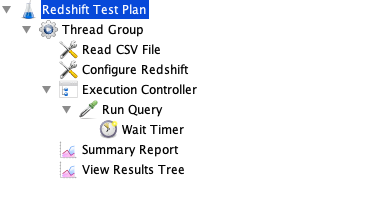

I need to run a load test against Redshift. However, rather than repeatedly running a few sample queries,  I want to replay all queries from the audit log over a period of time. I had never tried to do this in JMeter so it took a little hacking to get it working. I'm running this against Redshift, but the logic should apply to any workload. For example, you could use your web server logs to replay HTTP requests.

## Audit Log

You can query the audit log in Redshift from the `stl_query` table. For example, the following query will return all queries run today. Note that I am converting the `starttime` to the number of seconds into the test this query should be run when I replay it. 

```sql
SELECT  query, 
        DATEDIFF(second, '2021-06-03',  starttime) AS Start,
        querytxt
FROM stl_query
WHERE userid = 100
AND starttime BETWEEN '2021-06-03' AND '2021-06-03'
ORDER BY starttime 
```

With a little massaging, I end up with a flat file that looks like this. Obviously  have replaced the original queries. 

```text
Test	Start	Query
1	0       SELECT count(*) AS Count FROM users;
2	1       SELECT count(*) AS Count FROM users;
3	1       SELECT count(*) AS Count FROM users;
4	5       SELECT count(*) AS Count FROM users;
5	5       SELECT count(*) AS Count FROM users;
6	5       SELECT count(*) AS Count FROM users;
7	10      SELECT count(*) AS Count FROM users;
8	10      SELECT count(*) AS Count FROM users;
9	10      SELECT count(*) AS Count FROM users;
10	10      SELECT count(*) AS Count FROM users;
```

## Test Plan

My test plan looks like this.



Let's walk through the steps.

**Thread Group** sets up 35 threads (i.e. users) with a ramp time of 0. In my case, I expect a max concurrency of about 30 users users, so 35 threads should suffice. A few extra users will ensure there is a spare thread in case one of the requests runs a little long. All threads start immediately, but the test plan will explicitly sleep each thread as needed. 


**Read CSV File** is a *CSV Data Set Config* that reads the file above. It defines three variables: `test`, `start`, and `query`. I never actually use the `test` variable. Each thread will read the next line from the file. This drives the overall test. 


**Configure Redshift** is a *JDBC Connection Configuration* that defines the connection pool for Redshift. You will need to add the [Redshift JDBC driver](https://docs.aws.amazon.com/redshift/latest/mgmt/configure-jdbc-connection.html) to the JMeter lib folder and restart JMeter if you are running a Redshift test. 

**Execution Controller** is a *Simple Controller* that groups the Query and Wait together. Honestly, I'm not clear why I need a controller here, but the Run Query task would not wait for the timer unless I added it. 

**Run Query** is a *JDBC Request* that executes whatever is in the query variable for the current thread against the Redshift connection pool.


**Wait Timer** is a *Constant Timer* that sleeps until it's time execute the query. It is a child of **Run Query** so that it only delays the Run Query step. Note that the wait occurs before **Run Query** executes. 


The wait is calculated as follows, where time() is the current time in ms and TESTSTART.MS is the time the test started in ms. Therefore, the new wait variable is the time from now that the next step should start (in ms).

```java
${ __jexl2( (${start}*1000) -  (${__time()} - ${TESTSTART.MS}) ) }
```

**Summary Report** and **View Results Tree** simply export test results in different formats. These are optional and cen be eliminate or replaced with another Listener if you prefer. 

Overall this seems to meet my goals. It's not perfect -- some queries are delayed a few seconds -- but over the course of a day that should not matter much. If you have a better way, please add it in the comments. If you would like, you can download [my test plan](redshift-test-plan.jmx).