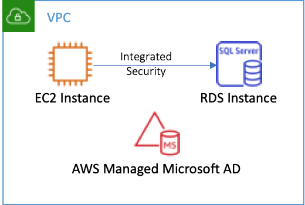

AWS Directory Services allows you to join AWS resources to Microsoft Active Directory. This includes Amazon Relational Database Service (RDS), Amazon FSx, Amazon Workspaces, Amazon Appstream 2.0, Amazon Connect, Amazon QuickSight, Amazon WorkDocs, Amazon WorkMail, and of course Amazon Elastic Compute Cloud (EC2) Windows instances. In addition, AWS recently announced the ability to [Seamlessly Domain Join Linux EC2 Instances](https://aws.amazon.com/about-aws/whats-new/2020/08/seamlessly-join-amazon-ec2-for-linux-instance-to-aws-directory-service/).

As I modernize .NET applications by moving to .NET 5 and Linux, I can continue to leverage Active Directory for credential management. Seamless domain join for EC2 Linux greatly simplifies the undifferentiated heavy lifting of configuring these architectures. This post will explore how to connect to RDS for SQL Server from a .NET 5 application running on EC2 Linux, using domain credentials.

## Deploying Resources

Let me begin by explaining my environment, pictured below. First, I deployed AWS Managed Microsoft AD Standard Edition with a fully qualified domain name (FQDN) of **example.com** in the default VPC in us-west-2. Next, I deployed an RDS SQL Server Express Edition database named **demodb**. I chose **sqladmin** as the master username and joined the example.com domain by choosing the **Enable Microsoft SQL Server Windows authentication** option. Finally, I deployed an EC2 instance running the **Amazon Linux 2 with .Net Core, PowerShell, Mono, and MATE Desktop Environment** Amazon Machine Image (AMI) following the procedure in [this blog post](https://aws.amazon.com/blogs/aws/seamlessly-join-a-linux-instance-to-aws-directory-service-for-microsoft-active-directory/). I also added both the RDS and EC2 instances to the default security group to ensure they could communicate.
 


## Configuring SQL Server

Once everything is running, I need to configure SQL Server. Note that if you are connecting to an existing SQL Server, you can skip this step. While I joined the RDS Instance to the domain, RDS does not grant access to any domain users by default. I’ll do that now using the Linux command line, but you could do this in SQL Server Management Studio as well. 

I connect to the EC2 instance using ssh. While domain users have access to the instance, they do not have root access by default. Therefore, I am going to log in using the default **ec2-user** user and my private key to install a few tools.  

```bash
ssh -i mykey.rsa ec2-user@ec2-xxx-xxx-xxx-xxx.us-west-2.compute.amazonaws.com
```

Once connected, I install the Microsoft SQL Server client tools.

```bash
sudo yum install -y mssql-tools
```

Then, I connect to SQL Server using the master credentials to grant permission to our domain users. Once connected, I grant access to all domain users through the BUILTIN\Users role. Note that you will probably want to be more selective about who gets access.

```bash
/opt/mssql-tools/bin/sqlcmd -S demodb.xxxxxxxxxxxx.us-west-2.rds.amazonaws.com -U sqladmin 
1> ALTER SERVER ROLE [processadmin] ADD MEMBER [BUILTIN\Users];
2> GO
```

## Testing Domain User Access

With SQL Server configured, I am going to log out and log back in with my Active Directory credentials. Note that I included my user name (brian) along with the domain name (example.com).

```bash
ssh brian@example.com@ec2-xxx-xxx-xxx-xxx.us-west-2.compute.amazonaws.com
```

Before writing my .NET application, I confirm I have access to the database using the sqlcmd client. This is the same tool I used above, but there are two important changes in the command line syntax. First, I no longer need to supply a username and password, because I am authenticating with my domain credentials. Second, while I used the public fully qualified domain name (FQDN) above, I MUST use a name relative to the private FQDN. Linux uses the Kerberos protocol to authenticate with Active Directory. Kerberos authentication requires that the endpoint be the customer-specified host name, a period, and then the fully qualified domain name. Note that RDS will create and maintain both the public and private DNS entries and Service Principal Name (SPN) for the database.

```bash
/opt/mssql-tools/bin/sqlcmd -S demodb.example.com 

1> SELECT system_user, auth_scheme FROM sys.dm_exec_connections WHERE session_id=@@spid;
2> GO

system_user              auth_scheme       
------------------------ ------------------------
example\brian            KERBEROS    
```

The query above will return the name of the current user and authentication scheme (e.g. Kerberos). This confirms that everything is configured correctly.

## Connecting from .NET 5

Now that everything is configured, I can create a .NET application using the **dotnet** cli. I will also add a reference to the SQL Client NuGet package used to connect to SQL Server.

```bash
mkdir linux_mssql_demo 
cd linux_mssql_demo
dotnet new console
dotnet add package System.Data.SqlClient
```

Now, I open Program.cs and replace the contents with the following code. Notice that I am connecting using **Integrated Security**. That means that I am using the credentials of the current user. Also, note that I included the default SQL Server port, 1433. If you exclude the port, the SQL client may fail to connect. This occurs because it does not implicitly include the port when looking up the Kerberos Service Principal Name (SPN).

```csharp
using System;
using System.Data.SqlClient;

namespace linux_mssql_demo
{
    class Program
    {
        static void Main(string[] args)
        {
            using (var connection = new SqlConnection("Server=demodb.example.com,1433;Integrated Security=true;"))
            {
                var command = new SqlCommand("SELECT system_user, auth_scheme FROM sys.dm_exec_connections WHERE session_id=@@spid;", connection);
                connection.Open();
                using (var reader = command.ExecuteReader())
                {
                    while (reader.Read())
                    {
                        Console.WriteLine($"SQL Server User: {reader[0]}; Authenticated Using: {reader[1]}");
                    }
                }
            }
        }
    }
}
```

Finally, I can run my .NET application and ensure that it properly connects to RDS.

```bash
dotnet run
SQL Server User: EXAMPLE\brian; Authenticated using: KERBEROS
```

## Unattended Execution

In the example above, I was logged into the Linux instance. As a result, the dotnet application ran under my credentials. Often, I want the application to run unattended. For example, imagine that our application will be running as a daemon or scheduled as a cron job. I want the application to connect to SQL Server using domain credentials for a user called **demo-service-account**. Obviously, that user is not going to be logged into an interactive session. Therefore, I need to store the user’s credentials. I can do that using a keytab file.

I start by creating a new keytab file using **ktutil** as follows.

```bash
ktutil
ktutil:  addent -password -p demo-service-account@EXAMPLE.COM -k 1 -e rc4-hmac
Password for demo-service-account@EXAMPLE.COM: 
ktutil:  wkt demo-service-account.keytab
ktutil:  exit
```

Now I can load the credentials for demo-service-account by running **kinit** and referencing the keytab file. Notice that **dotnet run** now executes the query as demo-service-account. 

```bash
kinit demo-service-account@EXAMPLE.COM -k -t demo-service-account.keytab
dotnet run
SQL Server User: EXAMPLE\demo-service-account; Authenticated using: KERBEROS
```

If I want to switch back to my credentials, I run kinit without specifying a keytab file.

```bash
kinit brian@EXAMPLE.COM
Password for brian@EXAMPLE.COM:  
dotnet run
SQL Server User: EXAMPLE\brian; Authenticated using: KERBEROS
```

Note that keytab file must be regenerated if you change the service account password.

## Conclusion

As I modernize .NET applications by moving to Linux and .NET 5, I can continue to leverage Active Directory for credential management. Numerous AWS services integrate with Active Directory. In this post I used AWS Directory Services to automate the deployment of Active Directory. I also used Seamless Domain Join to join a Linux EC2 Instance to the directory and configure Kerberos authentication. I chose to use an AMI with .NET 5 preconfigured. Finally, I used RDS to enable Windows authentication, configure DNS, and create a Service Principal Name (SPN) for SQL Server. Each of these services greatly reduced the manual configuration needed to get my solution running. Finally, [here is a template](template.cfn.yaml) to set all of this up.
