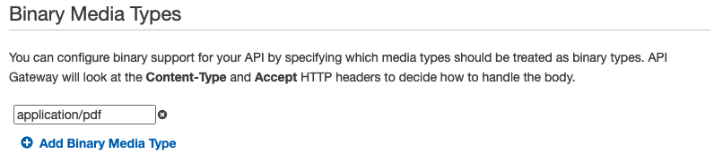
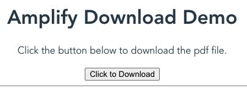

AWS Amplify is a framework to accelerate web and mobile application development. I needed to build an API that would return a binary object. Specifically, it allows me to download a PDF file. I could not find an example so I am documenting it here. In the end it was crazy simple. You just need to add a single line `"BinaryMediaTypes": ["application/pdf"]` to the `AWS::ApiGateway::RestApi` resource in the CFN template created by Amplify. You should make this change after Amplify generates the API but before you push it to AWS. 

## Background

Most Serverless Lambda functions return JSON or some other text data like this. 

```javascript
return {
    "statusCode": 200,
    "headers": {
        "Content-Type": "application/json"
    },
    "isBase64Encoded": false,
    "body": '{"Hello": "World"}'
};
```

However, you can return binary data by base64 encoding the response. You should also set the `isBase64Encoded` flag to tell API Gateway, or some other service that invoked the serverless function, that the response is encoded.

```javascript
return {
    "statusCode": 200,
    "headers": {
        "Content-Type": "application/pdf"
    },
    "isBase64Encoded": true,
    "body": binaryData.toString('base64')
};
```

In addition, if you are using an API Gateway REST API, you need to configure the Binary Media Types in the API Settings, like this. 



Finally, you must send an `Accept` header with the request to tell API Gateway that you want binary data, like this.

```bash
curl -H "Accept: application/pdf" https://xxxxxxxxxx.execute-api.us-east-1.amazonaws.com/stage/method/
```

All of this is [well documented](https://aws.amazon.com/blogs/compute/handling-binary-data-using-amazon-api-gateway-http-apis/), however I was did not want to manually update the configuration when using Amplify. First, the entire configuration will not be captured in my code. Second, I risk Amplify reverting the configuration if I push a change to the API. Therefore, I did the following. 

## Walkthrough

Let's do a quick walk through of the setup using Vue. The process is very similar using other frameworks. 

First, I created a new Vue project called demo.

```bash
vue create demo
# accept the default responses in the wizard
cd demo
npm install 
```

Now, I added Amplify to project.

```bash
amplify init
# ? Enter a name for the project demo
# ? Enter a name for the environment dev
# ? Choose your default editor: Visual Studio Code
# ? Choose the type of app that you're building javascript
# Please tell us about your project
# ? What javascript framework are you using vue
# ? Source Directory Path:  src
# ? Distribution Directory Path: dist
# ? Build Command:  npm run-script build
# ? Start Command: npm run-script serve
# Using default provider  awscloudformation
```

I installed the UI in Amplify packages

```bash
npm install aws-amplify @aws-amplify/ui-vue
```

Then I added the following to ./source/main.js after the existing import statements (about line 3).

```js
import Amplify from 'aws-amplify';
import '@aws-amplify/ui-vue';
import aws_exports from './aws-exports';
Amplify.configure(aws_exports);
```

Next I created the new download API

```bash
amplify add api
# ? Please select from one of the below mentioned services: REST
# ? Provide a friendly name for your resource to be used as a label for this category in the project: download
# ? Provide a path (e.g., /book/{isbn}): /download/{id}
# ? Choose a Lambda source Create a new Lambda function
# ? Provide an AWS Lambda function name: download
# ? Choose the runtime that you want to use: NodeJS
# ? Choose the function template that you want to use: Hello World
# Available advanced settings:
# - Resource access permissions
# - Scheduled recurring invocation
# - Lambda layers configuration
# ? Do you want to configure advanced settings? No
# ? Do you want to edit the local lambda function now? Yes
# Please edit the file in your editor: /Users/beabrian/Documents/demo/amplify/backend/function/download/src/index.js
```

The wizard should now pause and open `./amplify/backend/function/download/index.js`. I replaced the contents of index.js with the following. In this example, I log but otherwise ignore the input. Then I grab `sample.pdf` from an S3 bucket and return it. Obviously, a real world application would be more complicated. 

```js
const aws = require('aws-sdk');
const s3 = new aws.S3({ apiVersion: '2006-03-01' });

exports.handler = async (event, context) => {

    console.log(event);
    
    const params = {
        Bucket: "MyS3Bucket",
        Key: "sample.pdf",
    };

    const { ContentType, Body } = await s3.getObject(params).promise();

    const response = {
        statusCode: 200,
        headers: {
            'Access-Control-Allow-Origin': '*',
            'Access-Control-Allow-Headers': '*',
            'Content-Type': 'application/pdf',
        }, 
        isBase64Encoded: true,
        body: Body.toString('base64'),
    };
    return response;
};
```

After saving the file, I return to the terminal and finish the wizard.

```bash
# ? Press enter to continue 
# Successfully added resource download locally.
# Next steps:
# Check out sample function code generated in <project-dir>/amplify/backend/function/download/src
# "amplify function build" builds all of your functions currently in the project
# "amplify mock function <functionName>" runs your function locally
# "amplify push" builds all of your local backend resources and provisions them in the cloud
# "amplify publish" builds all of your local backend and front-end resources (if you added hosting category) and provisions them in the cloud
# Succesfully added the Lambda function locally
# ? Restrict API access No
# ? Do you want to add another path? No
# Successfully added resource download locally
```

**This is the important part.** The wizard does not allow you to change the media type. Therefore, I added the following line to `./amplify/backend/api/download/download-cloudformation-template.json` under the properties of the `AWS::ApiGateway::RestApi` (about line 51).

```bash
"BinaryMediaTypes": ["application/pdf"],
```

Finally, let's add a new Vue Component to handle the download. Add the following to `./amplify/src/components/Download.vue`.

```vue
<template>
  <div>
    <p>Click the button below to download the pdf file.</p>
    <button v-on:click="downloadFile">Click to Download</button>
    <hr>
  </div>
</template>

<script>
import { API } from 'aws-amplify';

export default {
  name: "Download",
  methods: {
    async downloadFile(){
      await API.post("download", "/download/8", {
        headers: {"Accept": "application/pdf"},
        body: {
          input: "anything"
        },
        responseType: 'blob',
        response: true
      }).then((response) => {
        const blob = new Blob([response.data], { type: 'application/pdf' })
        const blobURL = window.URL.createObjectURL(blob)
        const tempLink = document.createElement('a')
        tempLink.style.display = 'none'
        tempLink.href = blobURL
        tempLink.setAttribute('target', '_blank')
        document.body.appendChild(tempLink)
        tempLink.click()
        document.body.removeChild(tempLink)
        window.URL.revokeObjectURL(blobURL)
      })
    }
  }
}
</script>

<style scoped>
</style>
```

Finally, add the component to the application. Replace `./amplify/src/App.vue` with the following.

```vue
<template>
  <div id="app">
    <h1>Amplify Download Demo</h1>
    <Download />
  </div>
</template>

<script>
import Download from './components/Download'; 

export default {
  name: 'App',
  components: {
    Download
  }
}
</script>

<style>
#app {
  font-family: Avenir, Helvetica, Arial, sans-serif;
  -webkit-font-smoothing: antialiased;
  -moz-osx-font-smoothing: grayscale;
  text-align: center;
  color: #2c3e50;
  margin-top: 60px;
}
</style>
```

Now I can push our changes and Amplify will create the backend resources on AWS.

```bash
amplify push
npm run serve
```

My sample application looks like this.

