After two years of little to no travel, it picked back up in a big way for 2022. My daughter, Emily, has become a huge fan Dr Martens shoes during the pandemic. She is up to four pairs. So I have started taking detours to FaceTime her from Dr Martens stores in cities around the world. It turns out that these stores are in really interesting parts of town. These little detours have taken me to some cool places outside the tourist areas. 

## San Francisco (April 20)

My first speaking engagement was at the San Francisco AWS Summit. I walked past this store on the way to the Moscone Center early in the morning. I called Emily on the way back that evening. I didn't know it at the time, but this was the start of a trend.  

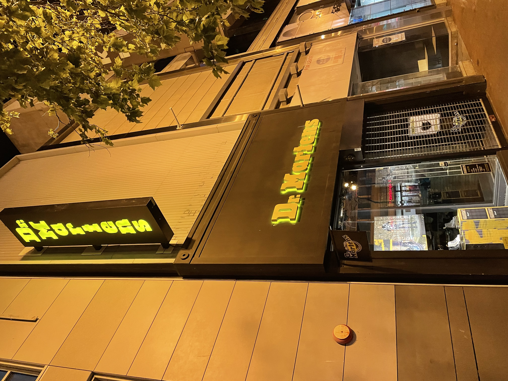

## London (April 27)

A week later, I was at the London Summit. Dr Martens is from England, and not surprisingly, there are many stores in London. I made it to two: Old Spitalfields Market and the Theater District. 

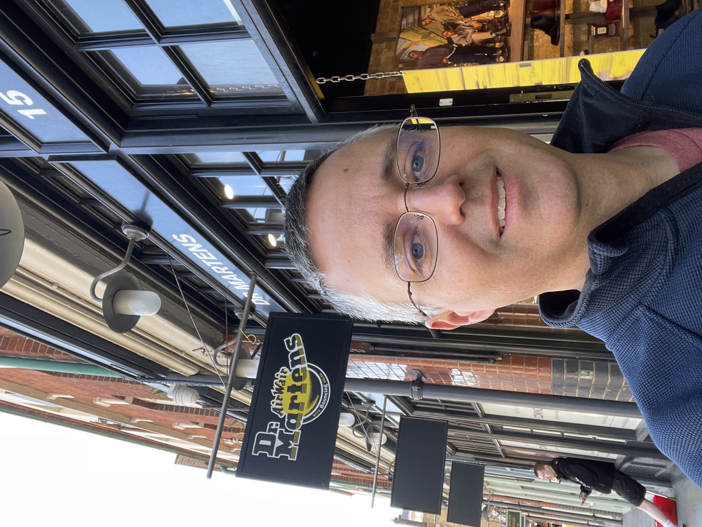

## Sydney (May 16)

In May, I was stranded in Sydney for 10 days after testing positive for COVID. Once I was out of quarantine, I stopped by mall to FaceTime Emily.  

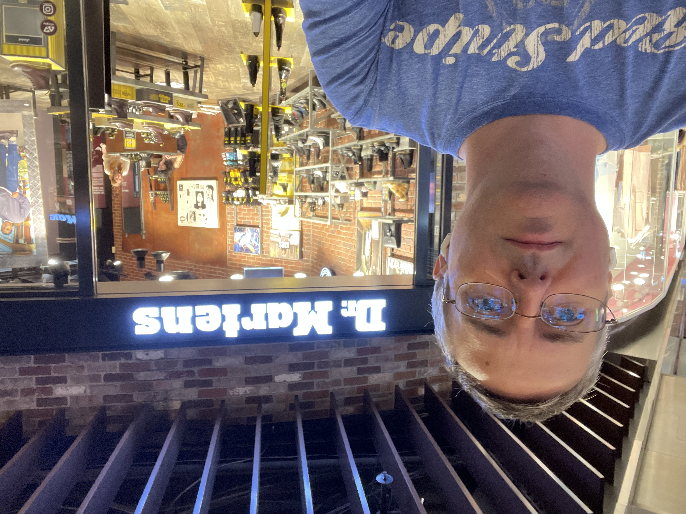

## Seattle (June 14)

I was at the Amazon Headquarters in Seattle in June. 

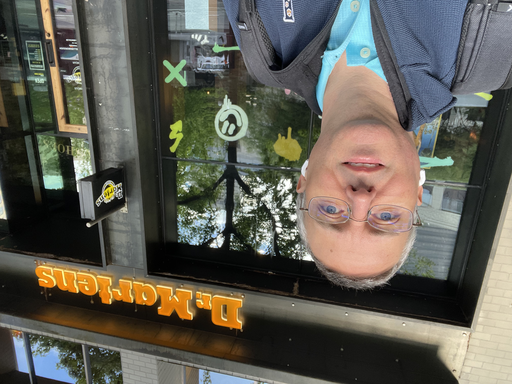

## Toronto (June 22)

Off to speak at another AWS Summit, this time in Canada. 

## New York (July 8)

In July, the family was visiting family on Long Island for Independence Day. I got to spend the day in NYC with both my daughters. Abby in the middle and Emily on the right.  

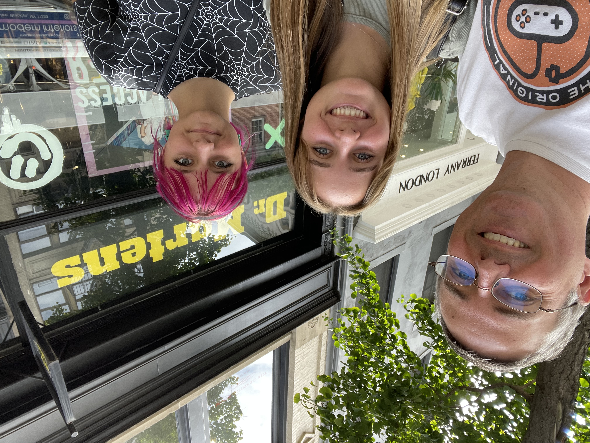

## New York (August 9)

The next month, I was back in NYC speaking at the Amazon office, and stopped by the midtown location. Unfortunately, I did not have time to stop at Shake Shack. Emily did ask :).

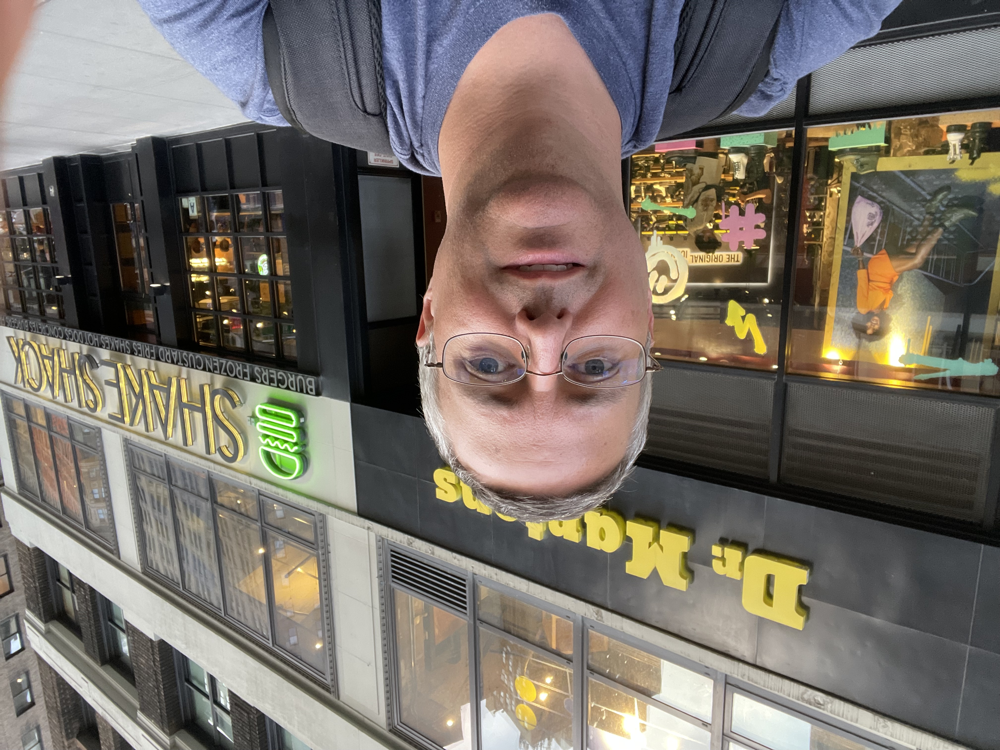

## Chicago (August 25)

My wife is from Chicago so the who family joined me for the Summit. Time was tight, but Emily and I jumped on the "L" and may a quick stop at the Dr. Martens store on State street. It's always more fun traveling with family.  

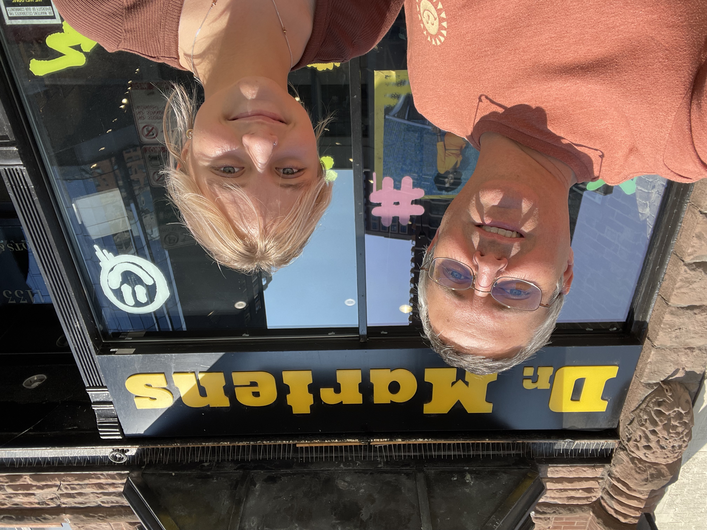

## Amsterdam (September 3)

I had a long layover in Amsterdam on my way to speak at the APJC Summit in Singapore. Long enough to leave the airport to have lunch, and FaceTime Emily. 

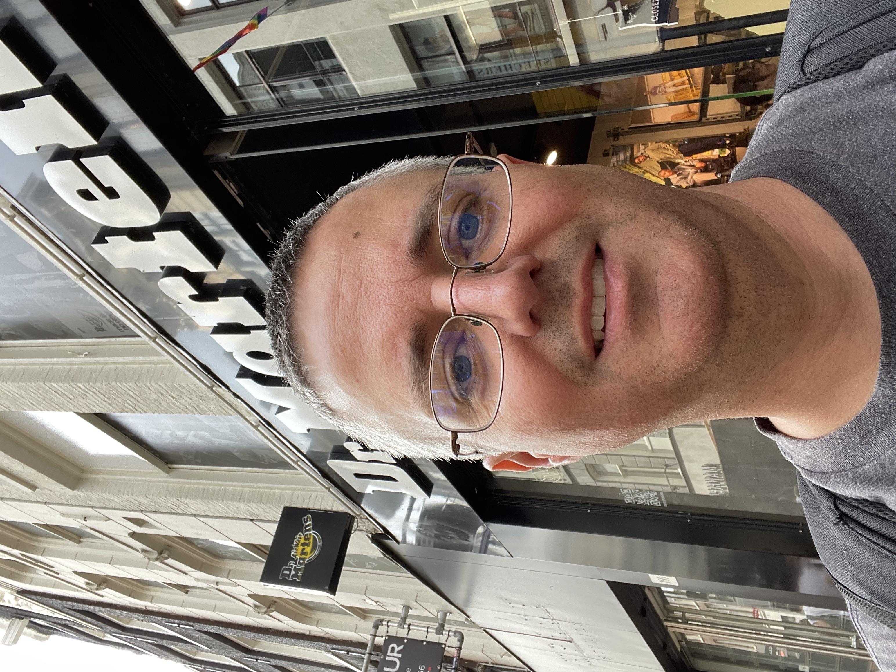

## Singapore (September 5)

Once in Singapore, I took the metro into the city to call Emily again. Sadly, this location is in a mall and not terribly exciting. 

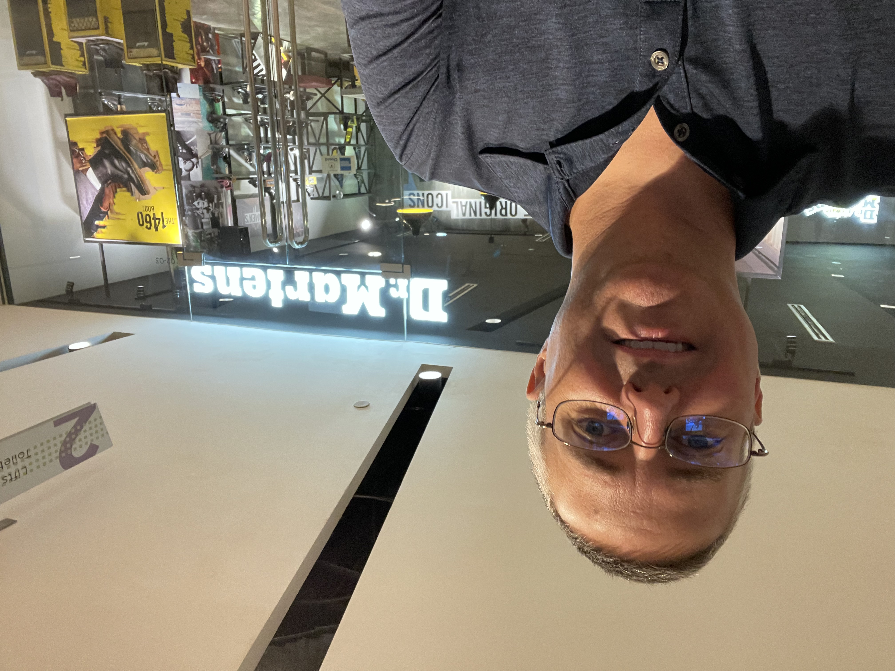

## Barcelona (September 19)

Later that month, we had internal meetings in Barcelona. My wife joined me and we extended the trip to visit Lisbon and Madrid. Unfortunately, there was no Dr Martens store in Portugal. The first thing we did when we got to Barcelona, was to stop by the gothic district. My wife found another location by the beach while I was in meetings. 

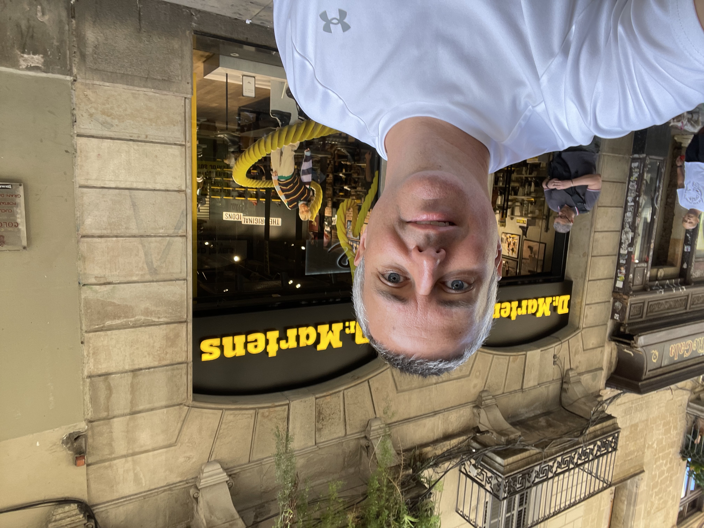
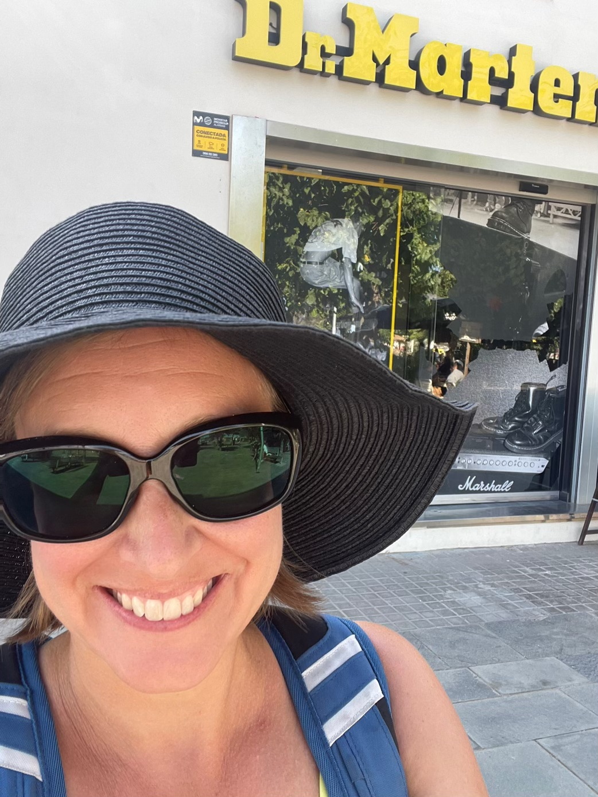

## Madrid (September 24)

We flew home from Madrid, and spend two nights exploring the city. Graffiti was everywhere in Madrid including the Dr Marten store. 

## Las Vegas (November )

The AWS Summits are long over and there is only one more event on the Calendar. re:Invent 2022 in Las Vegas later this month. I'll drop by the Fashion Show Mall to visit what I assume to be the last location of the tour. And, of course, I'll add a picture when I do. 

I love you Emily!