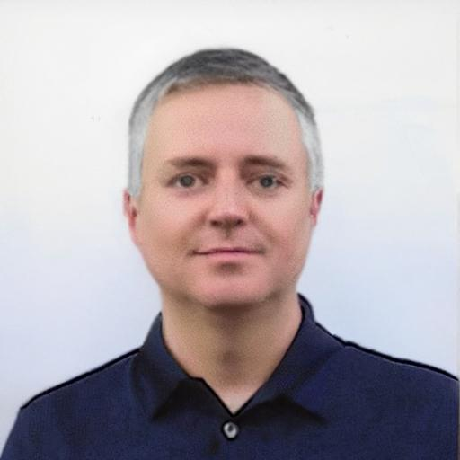

I have meaning to update my profile pictures for a few years now. The old one was nearly 20 years old and look a lot different. At least my hair is a lot greyer. Of course, I am never happy with a picture of myself. So, I decided to try a few new GenAI options. I have a recent picture that I like, but it was a blurry. So, I set out to either fix this one or generate something totally new but convincing.  

## Amazon Bedrock

I started with the playground in Amazon Bedrock with supports both Stability AI SDXL v1 and Amazon Titan Image Generator G1 v2. These are both primarily text-to-image models so my expectations were not that high. I prompted them both "Can you help me sharpen this image to use on my blog?"

Stability AI, which I often find leans toward the surreal, created this. Not at all what I had in mind.

Amazon titan, which I find generates more photo realistic content, created this. Much beter, but that is simply not me.

Clearly this was not going to work. I next set out to look an image-to-image model. 

## SageMaker Jumpstart

SageMaker has a few options for image-to-image models. I tried Stable Diffusion x4 upscaler FP16. My theory here was that a lowres copy of the original looks great. You cannot tell it is out of focus when the image is small. So I uploaded a 128x128 image and upscaled it hoping the new image would look sharper. It did not. 

## FaceFusion

In the end I settled on [FaceFusion](https://github.com/facefusion/facefusion) installed on a G5 EC2 instance. The Cuda install instruction worked perfectly on a the g5.xlarge, though I later upgraded to a g5.8xlarge.

I used the default face enhancer, `gfpgan_1.4`, with the following settings 
* Execution providers: cpu && cuda
* Execution thread count: 16
* Video Memory strategy: moderate

Also, I could not help edit the photo a little. I also used the default face editor, `live_porttrait`, to add +0.25 smile and -0.25 lip open. 

Here is the result, and the image I am now using on social media.

## Comercial Apps 

I also tried a few comercial apps. After a few free trial, I settled on [Portrait Pal](https://portraitpal.ai/). You upload a few reference images and it generates a 50-image virtual photo shoot for you for about $30. Here are a ew examples that I thought looked really good. Many of these are good enough to pass for me. Though I don't feel comfortable using them. 

