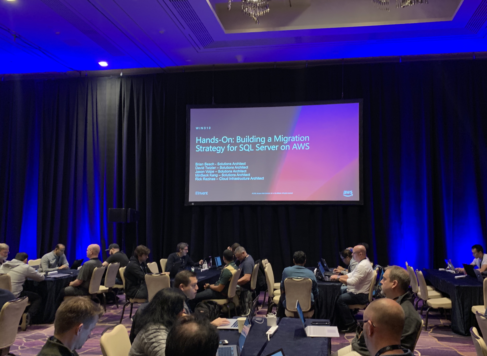
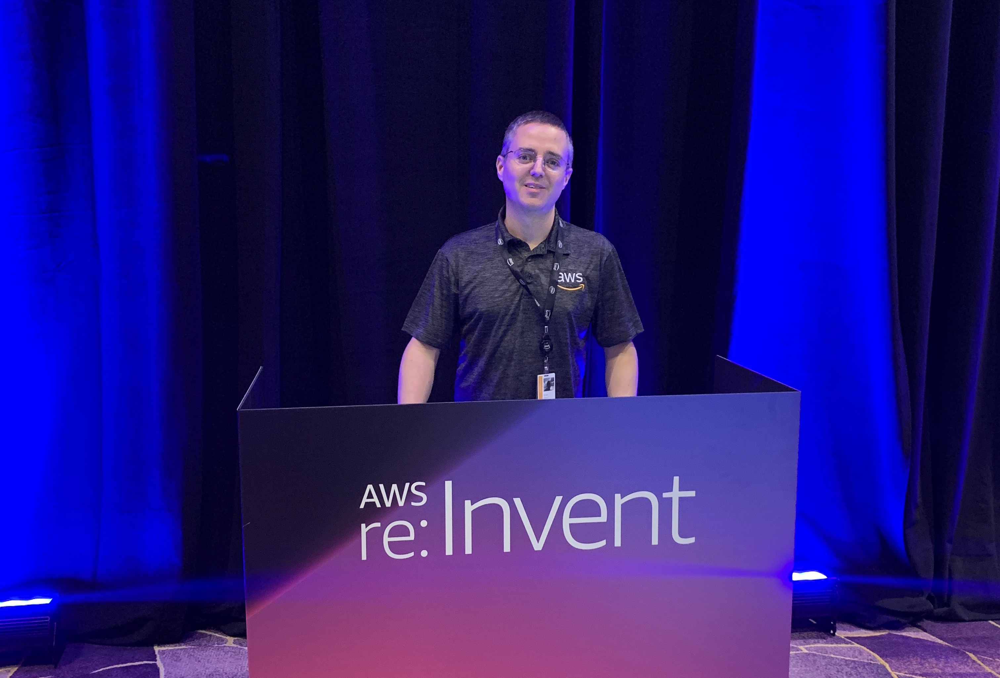

# Building a Migration Strategy for SQL Server on AWS

I'll be presenting the following workshop at re:Invent 2018.

[Slides](https://www.slideshare.net/AmazonWebServices/handson-building-a-migration-strategy-for-sql-server-on-aws-win310-aws-reinvent-2018)

[Workshop Instructions](https://awsentworkshops.com/reinvent2018/win310/win310index/)

[CloudFormation Template](prerequisites.yaml)

[Sample Schema on GitHub](https://github.com/brianjbeach/aws-database-migration-samples/tree/add-email/sqlserver/sampledb/v1)

