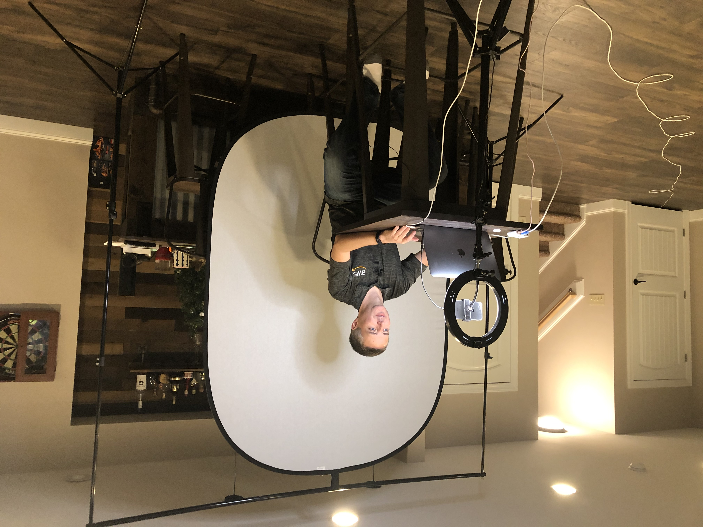

# Performance instrumentation and monitoring for .NET applications

I'll be presenting the following session at re:Invent 2020.

> Are you confident you can quickly identify service problems and resolve performance issues at scale? Isolating and remediating performance problems in the cloud, particularly with modern, distributed microservice architectures, can pose unique challenges. This session shows you how to capture logs, metrics, and telemetry for .NET applications across servers, containers, serverless architectures, and related components. Whether you are running IIS on a Windows server or Kestrel in a Linux container, learn how AWS services such as Amazon CloudWatch, CloudWatch Application Insights, AWS X-Ray, and more can cut through the chaos, isolate application performance issues, and troubleshoot the root cause of problems.

2020 has been an interesting year. Presenting from my basement was an interesing experiance. My kids are very excited that is a "YouTuber".

[Link to the re:Invent 2020 catalog](https://virtual.awsevents.com/media/0_u2kqp51w)

[Link to the recording](https://www.youtube.com/watch?v=EuMeijBXBFo)

[Link to the presentation](https://tbd)