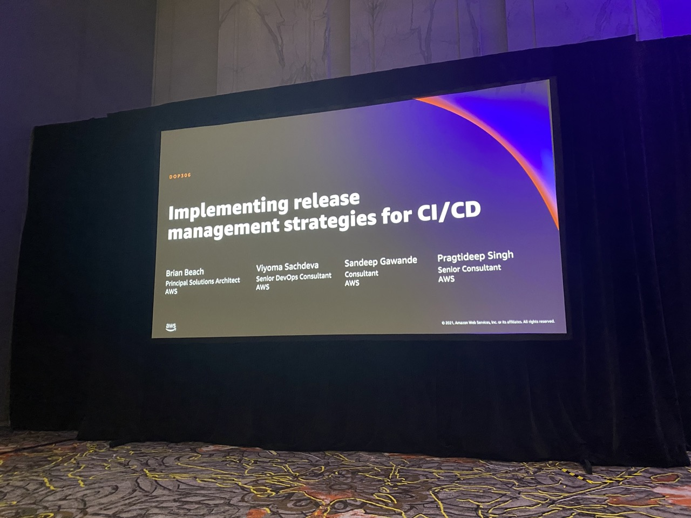
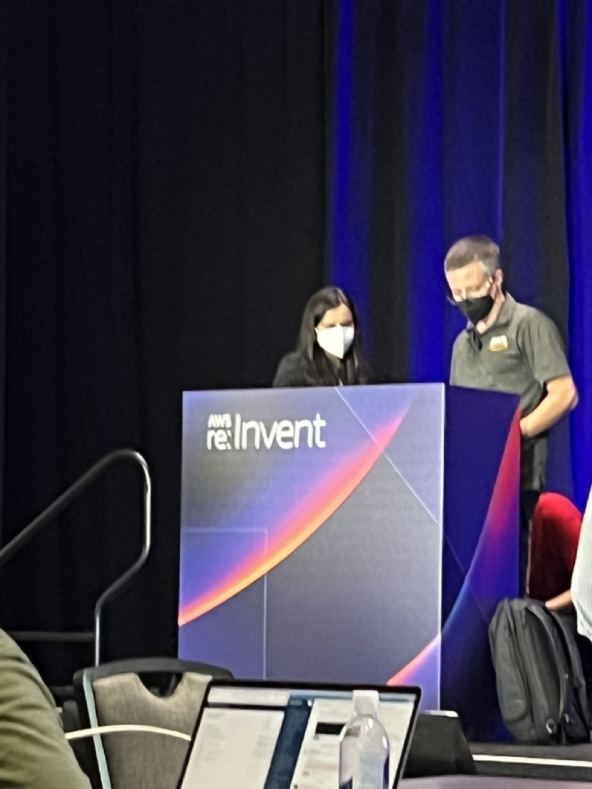
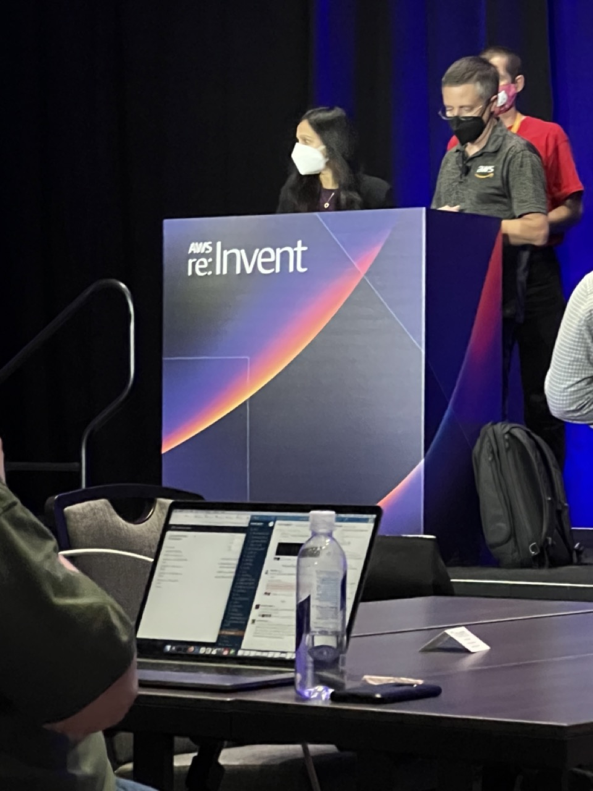
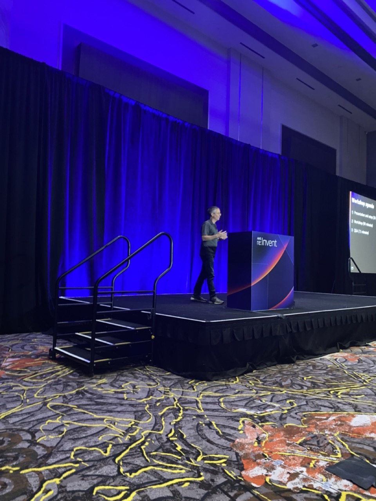
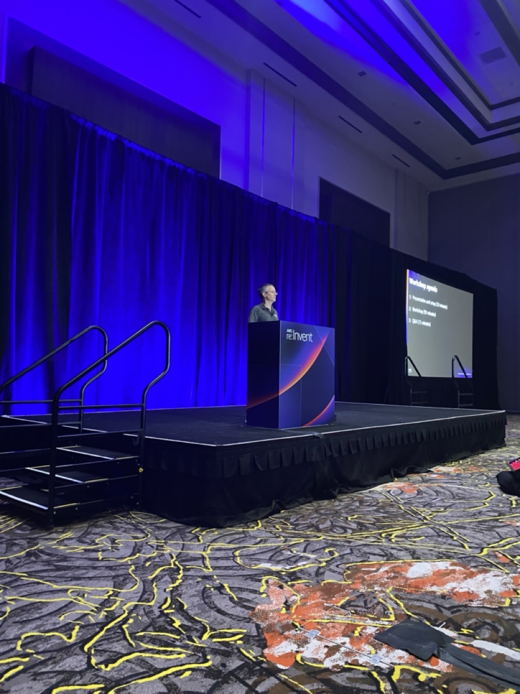
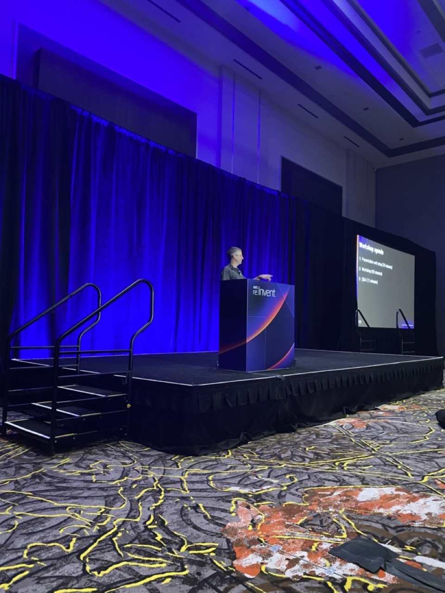

# Implementing release management strategies for CI/CD Pipelines Workshop

**Abstract:** This workshop will guide you through building CI/CD Pipelines with release management best practices, including artifact management as well as zero downtime release promotion and rollback mechanisms. We will evaluate various rollback/roll forward strategies across compute types and assess the need for manual processes.

The workshop instructions are [here](https://catalog.us-east-1.prod.workshops.aws/v2/workshops/1fc93b90-deb5-4262-bb5b-bccfe5f0593e/en-US).

Co-presented with [Viyoma Sachdeva](https://www.linkedin.com/in/viyoma-sachdeva-07125415/).

