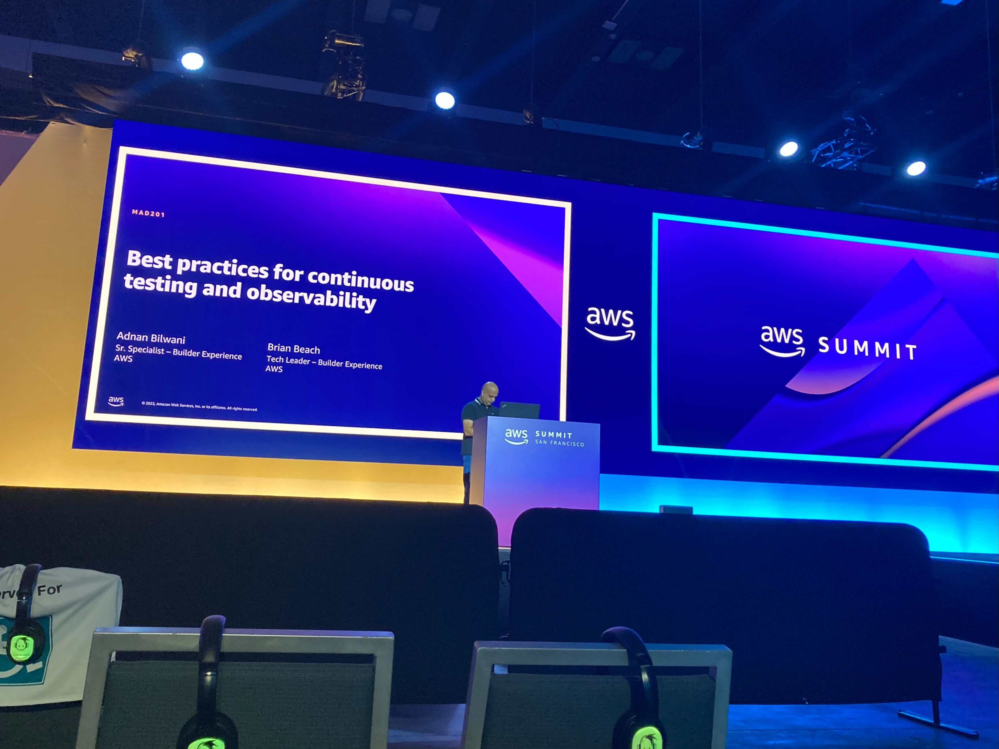

# Best practices for continuous testing and observability

**Abstract:** In this session, discover how to improve the resiliency of your applications through continuous resilience testing. Learn best practices for continuous testing using testing and observability tools such as AWS Fault Injection Simulator and Amazon DevOps Guru.

[View the recording](https://amersummit.awsevents.com/session-virtual/?v2477da705118cc74fd14460db021e1784e2eed5a7982c6482ec95cb2e86d259644b8741959f52a49e0e6908b82a9d860=8AA1F3E28CBEA39A8452FDC00E2BC7A91436D6E6CE3F87CEE1F814E35A80A183823E2435B21037FBA1390F96E4C6C792)

Co-presented with [Adnan Bilwani](https://www.linkedin.com/in/abilwani/).

