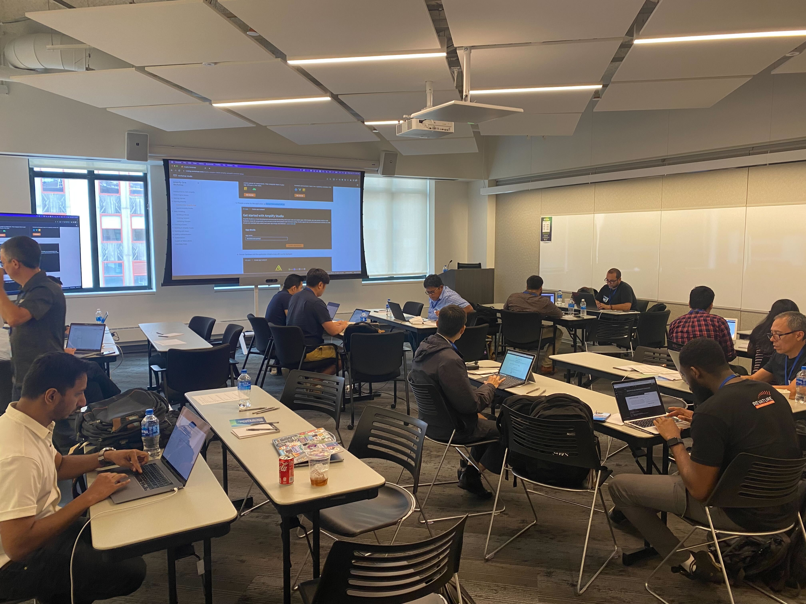

# Build and Host React Web Application with GraphQL on AWS Workshop

[AWS Solutions Day - New York City](https://aws.amazon.com/events/category/aws-solutions-day-aug10/)

**Abstract:** Modern web applications are developed using JavaScript web frameworks like React, Angular, Vue, Next.js and Nuxt.js. GraphQL has emerged as an API approach that simplifies data access and improves the performance of applications by enabling developers to fetch only the data they need for a view in a web or mobile application. Modern web applications use a hosting approach where static files (HTML, CSS and JavaScript) are served with low latency from a CDN with points of presence globally. In this workshop, you'll create a simple serverless web application that implements a "Todo app" with an GraphQL API to store and retrieve tasks in a cloud database. In addition, you will integrate machine learning to automatically identify and label objects in images attached to tasks.

