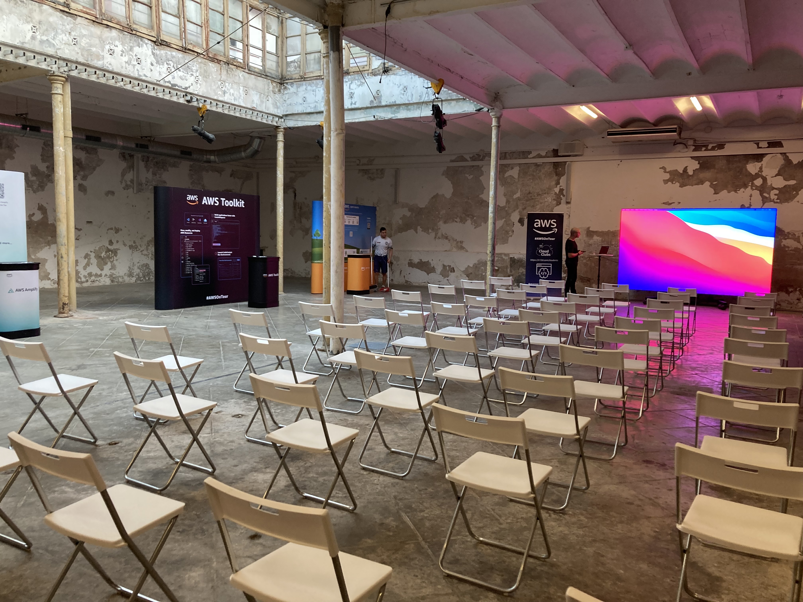
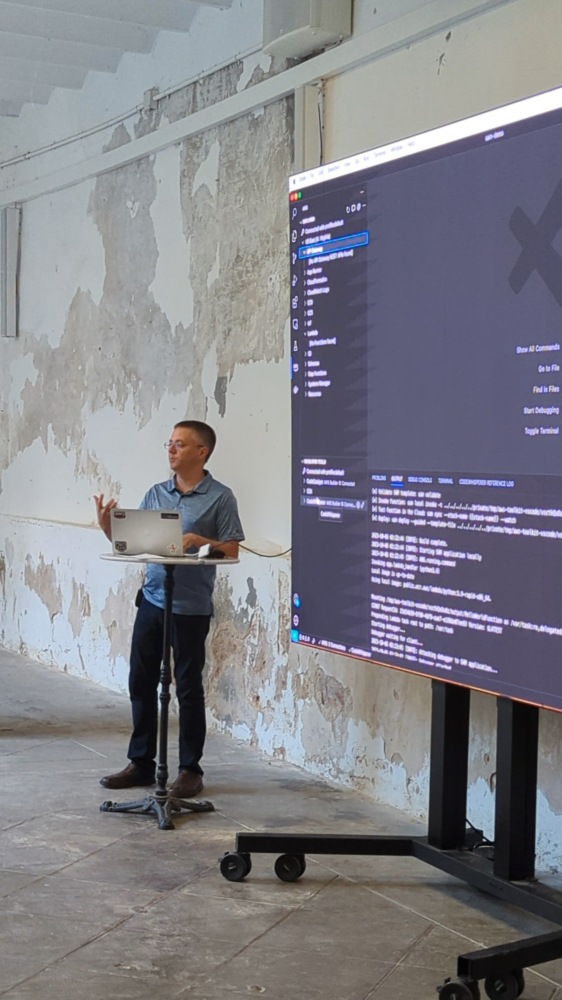
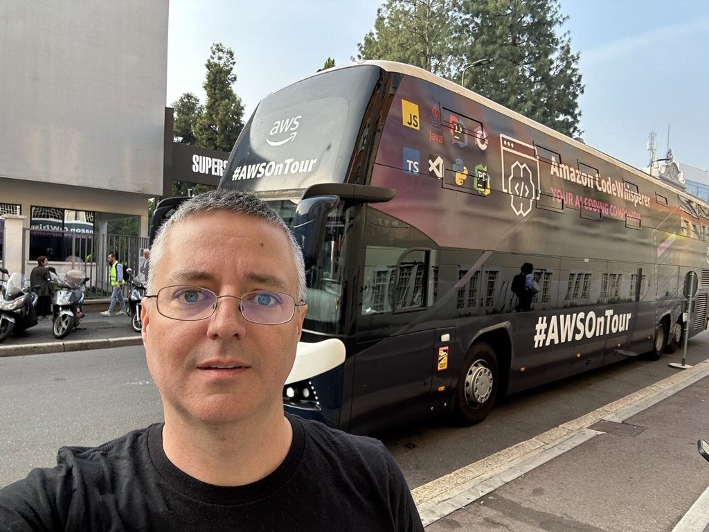
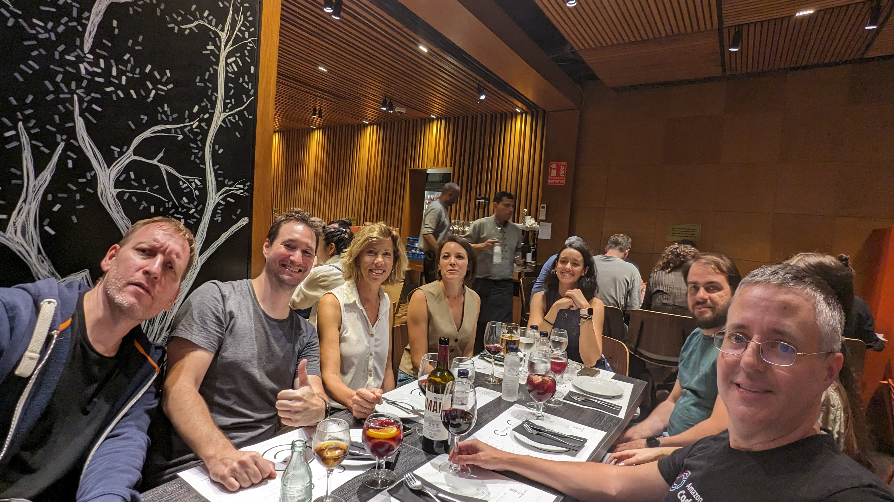

I presented two sessions in during [AWS On Tour](https://awsontour.splashthat.com/) in Barcelona, Spain

**Work with AWS right from your IDE** - Let's talk about how AWS can help you be a more productive developer. As software developers, you are always asked to do more with less. You need to ditch every impediments that slow down your flow, every context switch that hurts your productivity. The AWS Toolkit helps to stay focused in your favorite IDE. You can access your AWS services, you can deploy to AWS to test your project in minutes without having deep knowledge on infrastructure as code.

**Get to Production Fast with Pre-Integrated DevOps using Amazon CodeCatalyst** - Software developers spend a significant amount of time orchestrating tools, technologies, processes, and people in order to build and deliver modern applications. Amazon CodeCatalyst brings together everything software development teams need to plan, code, build, test, and deploy applications on AWS into a streamlined, integrated experience. In this session, you will see how to leverage development environments through CodeCatalyst using integrated development environments (IDE) and to rapidly build applications and orchestrate deployments using blueprints.

