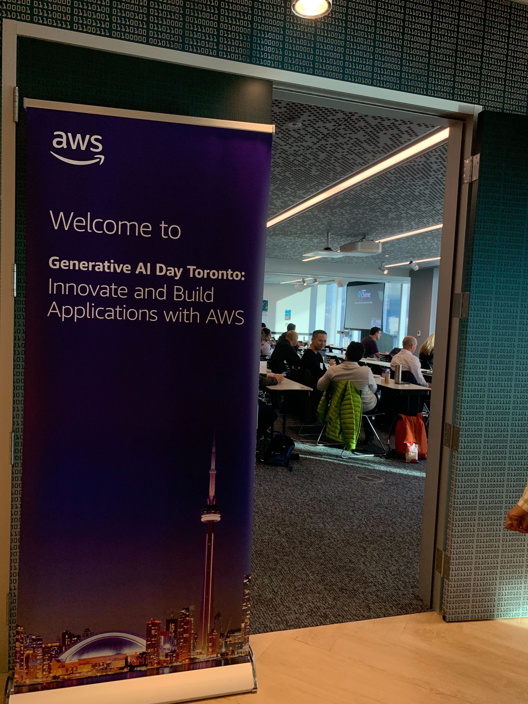
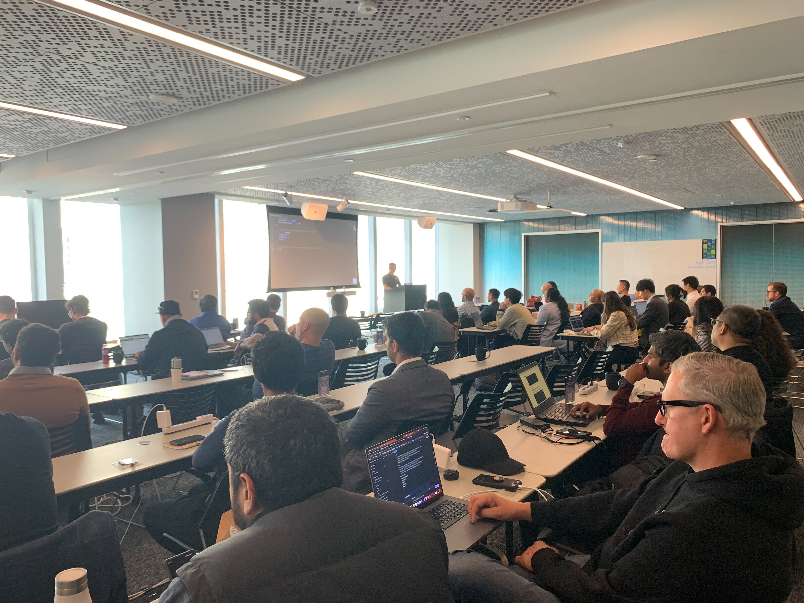

## Accelerate application development with Amazon CodeWhisperer

Developers spend a significant amount of their time writing undifferentiated code. Amazon CodeWhisperer, a generative AI–powered coding companion, radically improves productivity by generating code suggestions in real time to alleviate this burden. In this session, learn how CodeWhisperer can “write” much of this undifferentiated code, allowing developers to focus on business logic and accelerate the pace of their innovation. [Link](https://generativeai-day-toronto-build-and-innovate-with-aws.splashthat.com/)

