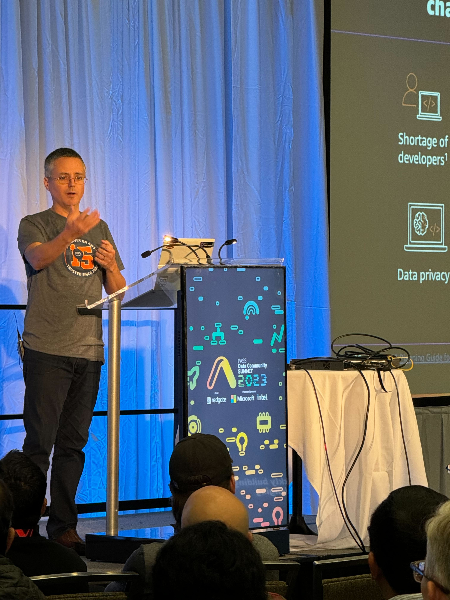
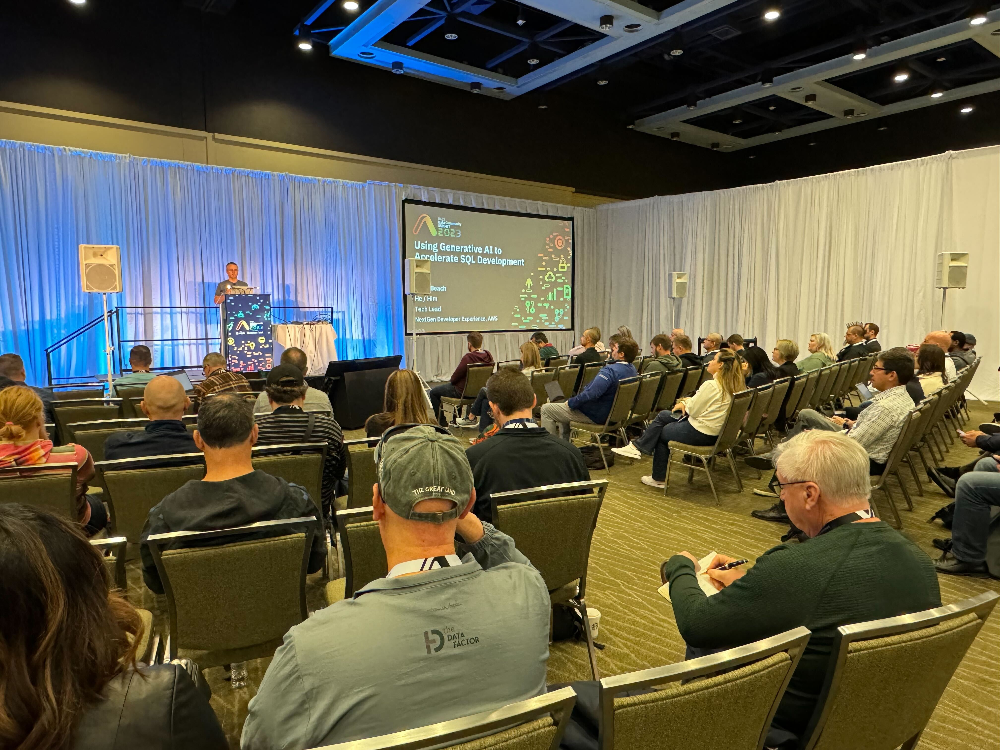
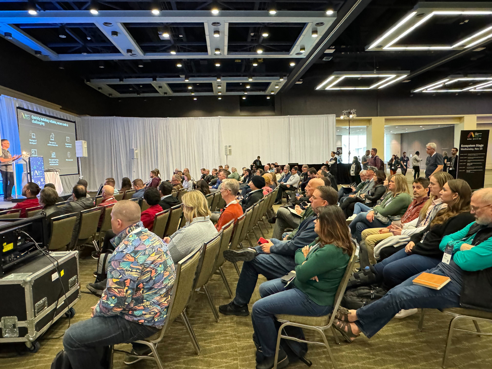
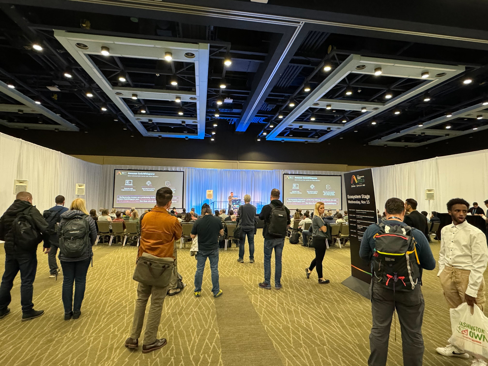

## Using Generative AI to Accelerate SQL Development

In this session, we will demonstrate how Amazon CodeWhisperer enables more agile and productive database development by taking natural language input about desired database operations and outputting the corresponding SQL code. We will cover examples of generating SQL with CodeWhisperer, best practices for crafting effective prompts, and how to refine the generated code to fit your database schema and requirements. Join us to see how you can leverage CodeWhisperer to save time and effort compared to manually writing SQL, delivering applications faster and more securely. [Link](https://passdatacommunitysummit.com/sessions/2031/)

