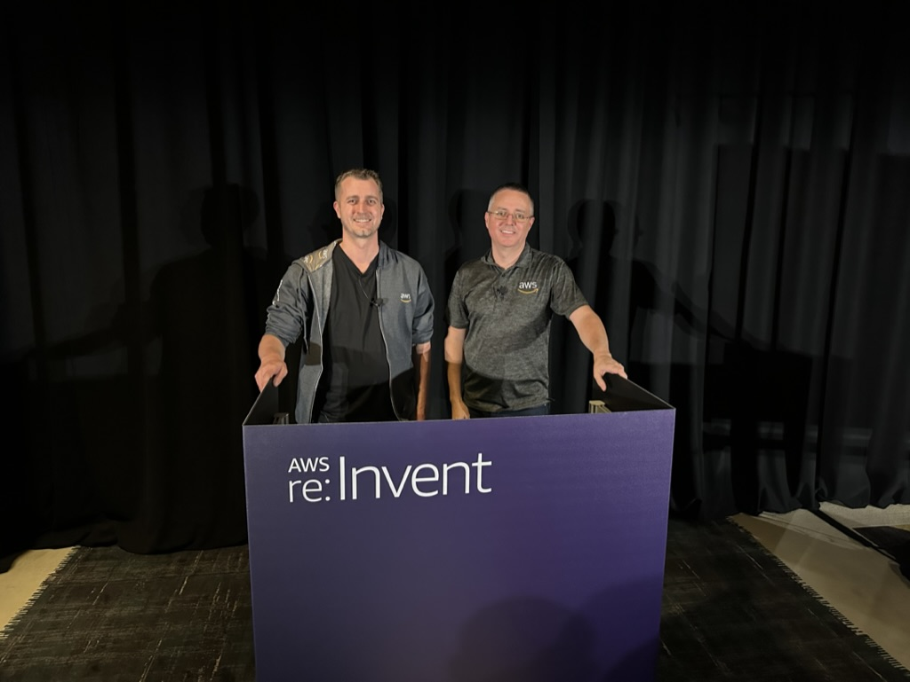
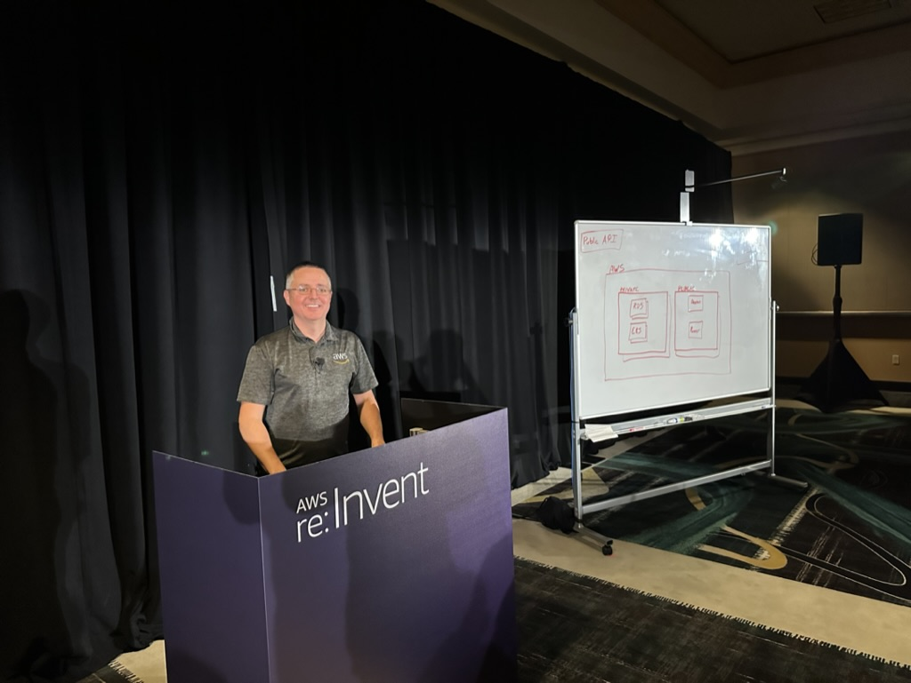
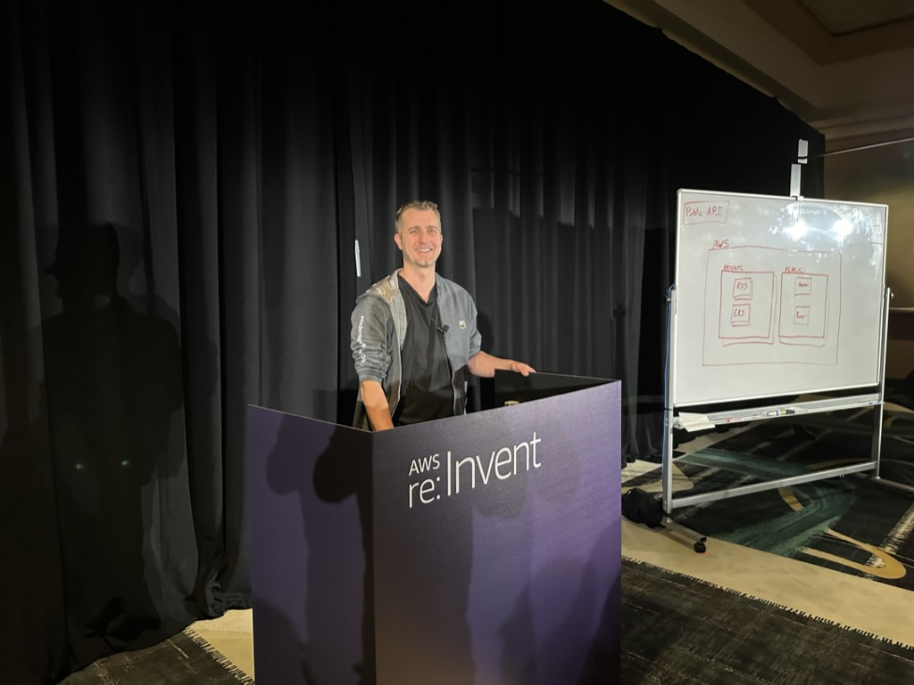
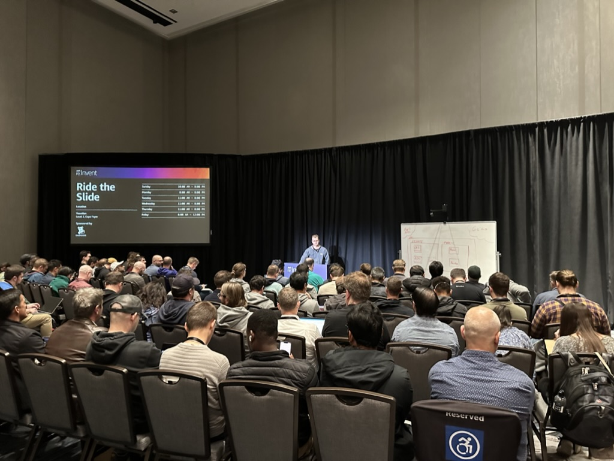

## DOP310 | Better together: GitHub Actions, Amazon CodeCatalyst, or AWS CodeBuild 

Learn how combining GitHub Actions with Amazon CodeCatalyst or AWS CodeBuild can maximize development efficiency. In this chalk talk, learn about the tradeoffs of using GitHub Actions runners hosted on Amazon EC2 or Amazon ECS with GitHub Actions hosted on CodeCatalyst or CodeBuild. Explore integration with other AWS services to enhance workflow automation. Join this talk to learn how GitHub Actions on AWS can take your development processes to the next level.

This session was repeated twice

