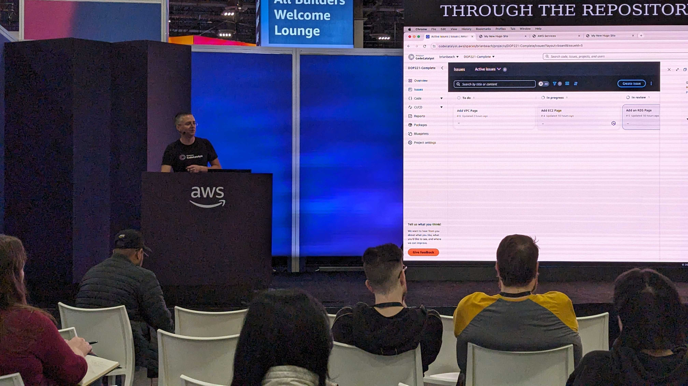
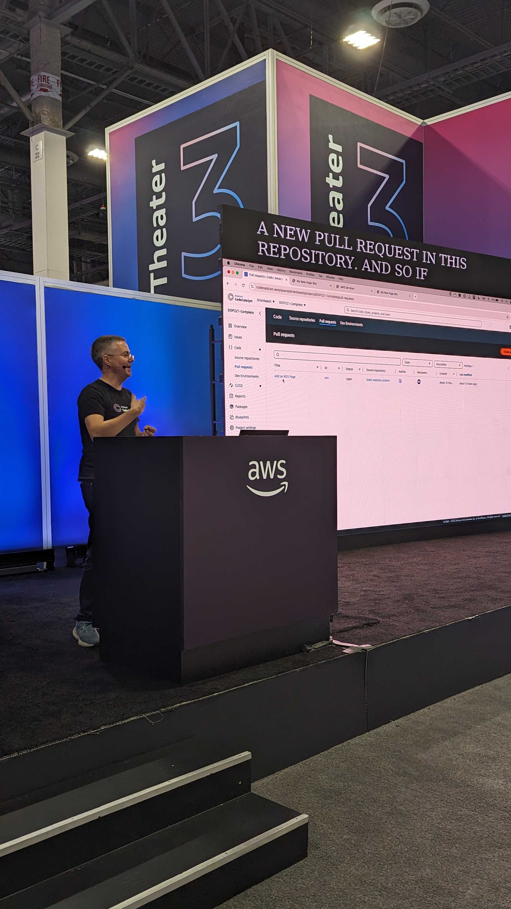

## DOP221 | Amazon CodeCatalyst in real time: Deploying to production in minutes

In this follow-up demonstration to DOP210, see how you can use an Amazon CodeCatalyst blueprint to build a production-ready application that is set up for long-term success. See in real time how to create a project using a CodeCatalyst Dev Environment and deploy it to production using a CodeCatalyst workflow. [Recording](https://www.youtube.com/watch?v=cRZ4kwF9qR0)

