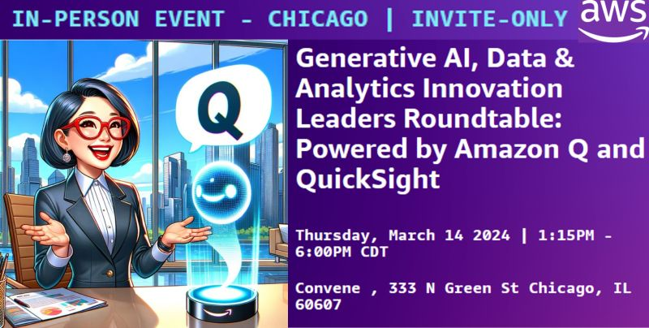
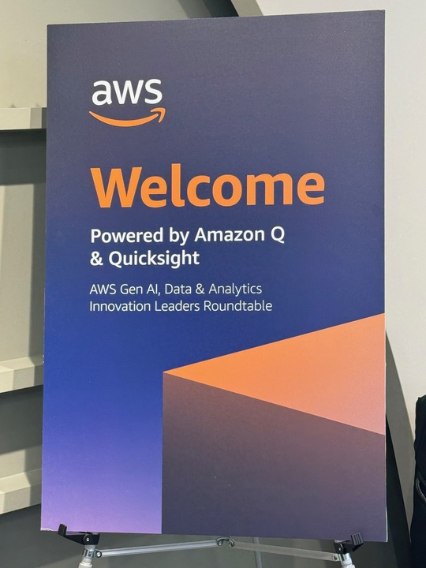
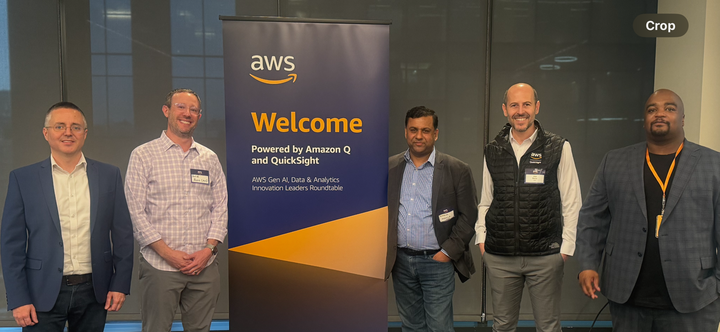
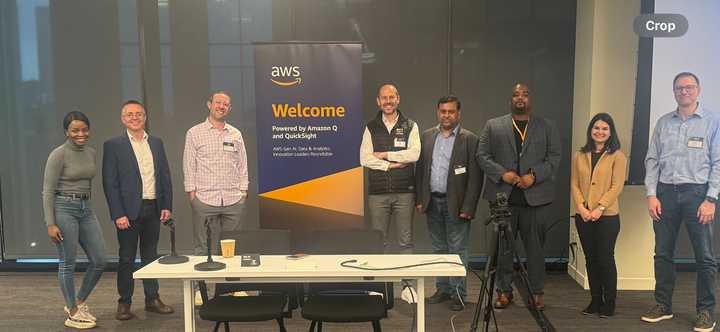

## Generative AI, Data & Analytics Innovation Leaders Roundtable

Amazon Web Services (AWS) is hosting a half-day in person executive round-table event in Chicago on 3/14, for leaders at software and enterprise companies – and we hope you can attend! Don’t miss this chance to see a demo of the newest #GenerativeAI capabilities powered by #AmazonQ, including #QuickSight, #Qbusiness, #Qbuilder & Databases and engage with #AWS & other industry leaders.

Don’t miss this opportunity and learn on how to best leverage #AmazonQ and #GenerativeAI & BI for your organization.
Join our leaders, David P., General Manager for Amazon Q; Neal Cauley, Principal Global GTM Leader for QuickSight; Asheesh Mangla, Principal GTM Leader for Amazon Q Business and Brian Beach, WW Tech Leader - NGDE in this unique event in Chicago.

This is an executive level event (by personal invite only) geared for technology, product and engineering leaders, C-suite, executive, and VP decision makers. Come prepared with questions and enjoy a moderated panel with AWS product leadership. Seats are limited, reserve your spot as soon as possible and don't miss this unique opportunity!

