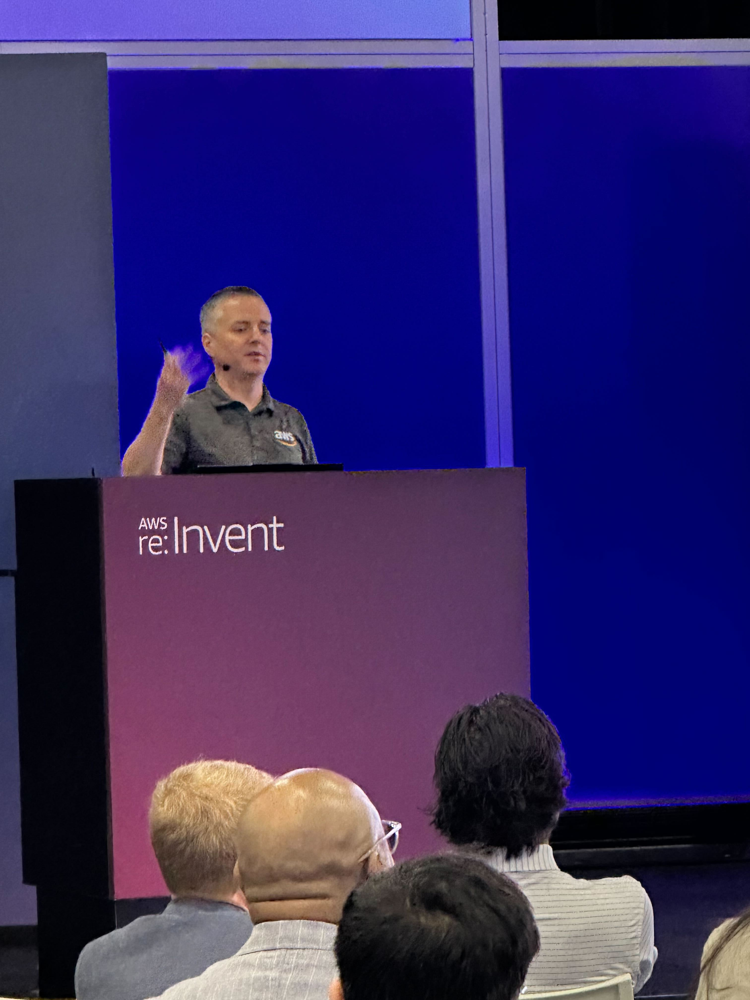

## DOP217 Best practices for customizing Amazon Q Developer

I presented a lightning talk twice this year. Here is a [link to the recording](https://www.youtube.com/watch?v=L2mmGKxAorQ)

> With Amazon Q Developer, you can securely connect to your private repositories to generate even more relevant code recommendations based on your internal code repositories, ask questions about your company code, and understand your internal code bases faster. In this session, learn how to set up customizations and generate code based on your internal repos. Use the Amazon Q Developer chat in your IDE to ask questions about how your internal code base is structured, where and how certain functions or libraries are used, and how to use specific functions, methods, or APIs.

