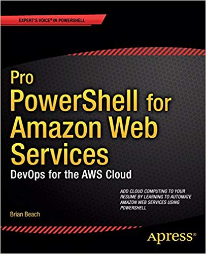

This book is a resource for using Microsoft's powerful scripting language, PowerShell, to create, host, manage, and administer workloads using a service widely recognized as the industry leader in cloud computing. Inside, find scripts to create and manage virtual machines, provision storage, configure networks with agility, and more--all using your preferred Windows scripting language.

[Buy it from Apress](https://www.apress.com/us/book/9781430264521)

[Buy it on Amazon](https://www.amazon.com/dp/B01HXEI5C0)