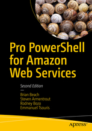

The completely revised and expanded Pro PowerShell for Amazon Web Services is written specifically for Windows professionals who already know PowerShell and want to learn to host Windows workloads on Amazon Web Services. The cloud offers information technology workers significant cost savings and agility unimaginable even just a few years ago. Tasks that traditionally took weeks of work, costing thousands of dollars, can be completed in minutes for a fraction of a penny.

[Buy it from Apress](https://www.apress.com/us/book/9781484248492)

[Buy it on Amazon](https://www.amazon.com/dp/B07Y7K4TMT)